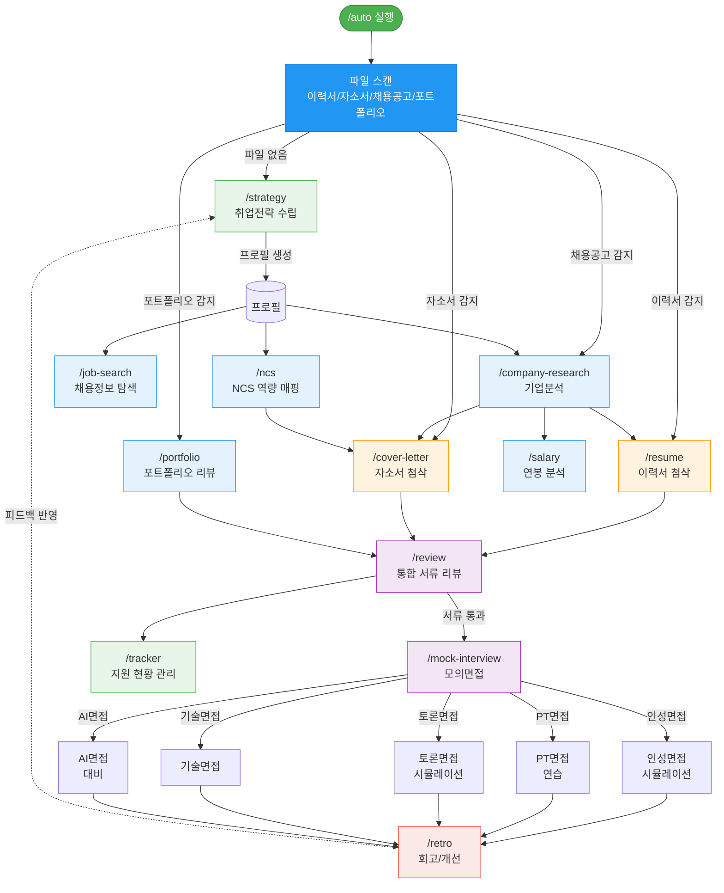
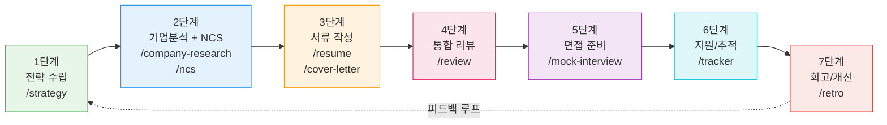
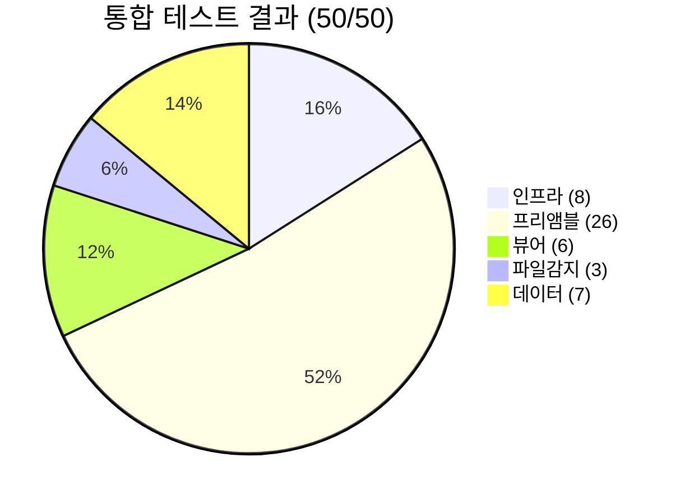
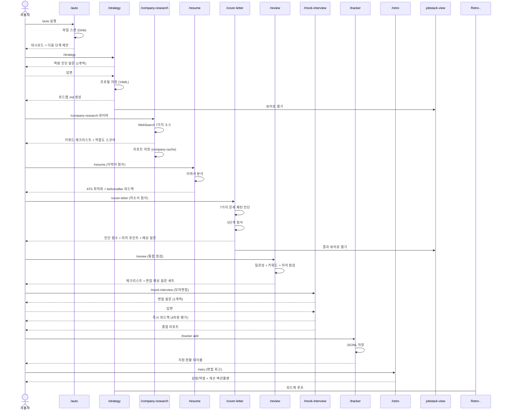
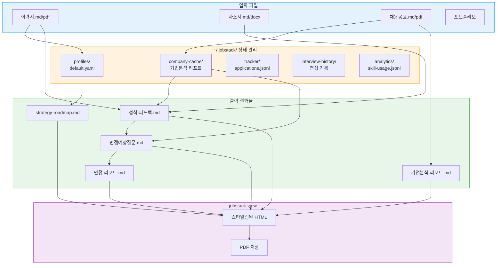

# jobstack

**한국 취업 통합 엑셀러레이터** — Claude Code 스킬 시스템

9년간 30건+ 자소서 첨삭에서 검증된 방법론을 AI 코칭으로 제공합니다.
기업분석부터 이력서, 자소서, 모의면접까지 취업 준비 전 과정을 통합 지원합니다.

---

## 핵심 철학

> **자소서는 일기장이 아니라 메뉴판이다.** 하소연이 아니라, 면접관이 맛보고 싶어하는 것을 차려놓아야 한다.

- **"결이요" 프레임워크** — 결론(5초) → 이유(수치) → 요청(비전)
- **미끼 전략** — 면접관이 물어보고 싶어할 포인트를 자소서에 배치하고 답변 준비
- **"이미 팀원처럼"** — 지원 팀의 제품/리뷰/업데이트를 분석하여 팀원처럼 대화
- **"바로 써보고 싶은 사람"** — 학생이 아닌, 당장 투입 가능한 실무자로 포지셔닝

---

## 전체 워크플로우



## 단계별 가이드



---

## 설치

```bash
git clone https://github.com/your-username/jobstack.git
cd jobstack
./install.sh
```

설치 후 Claude Code에서 `/auto`를 입력하면 자동으로 시작됩니다.

---

## 결과물 뷰어

모든 스킬의 결과물은 Markdown으로 저장됩니다. 내장 뷰어로 브라우저에서 보기 좋게 확인할 수 있습니다:

```bash
jobstack-view 자소서-첨삭결과.md    # 브라우저에서 열기
jobstack-view 기업분석-삼성전자.md  # 스타일링된 HTML로 변환
```

- Noto Sans KR 한국어 최적화 타이포그래피
- 다크모드 자동 지원
- 테이블, 코드블록, 인용문 등 완벽 렌더링
- **"PDF 저장" 버튼**으로 즉시 PDF 변환 (브라우저 인쇄 기능)
- 모바일 반응형 지원

---

## 스킬 목록

| 스킬 | 설명 | Tier |
|------|------|------|
| `/auto` | 파일 자동 감지 + 단계별 가이드 (진입점) | 1 |
| `/strategy` | 역량 진단 + 취업전략 + 로드맵 생성 | 1 |
| `/tracker` | 지원 현황 추적 + 일정 관리 | 1 |
| `/company-research` | 7가지 키워드 소스 기업분석 + 적합도 스코어링 | 2 |
| `/job-search` | 사람인/잡코리아/원티드 채용공고 탐색 | 2 |
| `/ncs` | NCS 역량 매핑 + 경험→역량 변환 | 2 |
| `/salary` | 연봉 벤치마크 + 협상 전략 | 2 |
| `/portfolio` | 포트폴리오 최적화 + 임팩트 표현 | 2 |
| `/retro` | 면접 회고 + 탈락 원인 분석 + 개선 | 2 |
| `/resume` | 이력서 작성/첨삭 + ATS 최적화 | 3 |
| `/cover-letter` | 자소서 작성/첨삭 ("결이요" + 5단계 첨삭) | 3 |
| `/mock-interview` | 모의면접 5가지 모드 (인성/PT/토론/AI/기술) | 4 |
| `/review` | 이력서↔자소서↔포트폴리오 통합 점검 | 4 |

---

## 사용 예시

### 초보자: `/auto`로 시작

이력서 파일이 있는 폴더에서 `/auto`를 실행하면:

```
╔══════════════════════════════════════════╗
║  jobstack 취업 준비 현황                   ║
╠══════════════════════════════════════════╣
║  [x] 프로필 — 이력서에서 자동 생성         ║
║  [x] 이력서 — resume.pdf 감지             ║
║  [ ] 이력서 첨삭 ← 추천 다음 단계          ║
║  [ ] 자기소개서                            ║
║  [ ] 모의면접                              ║
╚══════════════════════════════════════════╝
```

### 자소서 첨삭: 5단계 진단

```
자소서 진단 결과
━━━━━━━━━━━━━━━━━━━━━━━━━━━━━━━━
① 희망·의지형 종결어미    발견 [5건]  ⚠️
② 감정·감상 과다          발견 [3건]  ⚠️
③ 추상적 성과             발견 [4건]  ⚠️
④ 시간순 나열             발견       ⚠️
⑤ 기업 연구 부족          발견       ⚠️
━━━━━━━━━━━━━━━━━━━━━━━━━━━━━━━━
진단 점수: 40/100
```

### 기업 키워드 체크리스트

```
기업 키워드 체크리스트: 삼성전자 - SW엔지니어
━━━━━━━━━━━━━━━━━━━━━━━━━━━━━━━━━━
소스          키워드              반영
━━━━━━━━━━━━━━━━━━━━━━━━━━━━━━━━━━
채용공고      Python              O
채용공고      AWS                 X
CEO 신년사    AI 전환              O
인재상        도전정신             O
최신기사      반도체 투자확대       O
━━━━━━━━━━━━━━━━━━━━━━━━━━━━━━━━━━
반영률: 15/20 (75%) → 목표: 85%+
```

---

## 9년 첨삭 인사이트

jobstack은 2016년부터 2025년까지 9년간 30건 이상의 자소서 첨삭에서 추출된 실전 인사이트를 기반으로 합니다.

### 8대 원칙

1. **"바로 써보고 싶은 사람"** — 학습자가 아닌 즉시 투입 가능한 실무자
2. **"과장 없이, 그러나 강하게"** — 거짓 없이 임팩트 있게
3. **"5초 규칙"** — 첫 문장이 승부
4. **"수치가 없으면 성과가 아니다"** — before→after 필수
5. **"자소서는 설득 문서"** — 감정보다 논리
6. **"약점은 인정하되 역량을 보여줘라"**
7. **"기업 연구는 체계적으로"** — 7가지 소스 키워드 체크리스트
8. **"면접까지 일관된 스토리"** — 자소서 미끼 → 면접 답변

### 3가지 어조 전환 공식

| Before | After |
|--------|-------|
| "~하고 싶습니다" | "~하고 있습니다" |
| "흥미를 느꼈습니다" | 구체적 프로젝트/성과 서술 |
| "밤새 공부했습니다" | "XX% 성능 개선 달성" |

자세한 내용은 [ETHOS.md](ETHOS.md)를 참고하세요.

---

## 통합 테스트 결과

`test/run-integration-test.sh`로 전체 시스템 검증을 수행합니다.

```bash
./test/run-integration-test.sh
```

### 테스트 결과: 50/50 통과



### 테스트 항목별 상세

```mermaid
flowchart LR
    subgraph T1["1. 인프라 (8/8)"]
        direction TB
        T1A["install.sh<br/>심링크 13개 ✓"]
        T1B["jobstack-config<br/>set/get/list ✓"]
        T1C["상태 디렉토리<br/>6개 생성 ✓"]
    end

    subgraph T2["2. 프리앰블 (26/26)"]
        direction TB
        T2A["13개 스킬<br/>YAML 프론트매터 ✓"]
        T2B["13개 스킬<br/>bash 블록 ✓"]
    end

    subgraph T3["3. 뷰어 (6/6)"]
        direction TB
        T3A["HTML 생성 ✓"]
        T3B["marked.js CDN ✓"]
        T3C["한국어 폰트 ✓"]
        T3D["다크모드 ✓"]
        T3E["PDF 버튼 ✓"]
    end

    subgraph T4["4. 파일감지 (3/3)"]
        direction TB
        T4A["이력서 감지 ✓"]
        T4B["자소서 감지 ✓"]
        T4C["채용공고 감지 ✓"]
    end

    subgraph T5["5. 데이터 (7/7)"]
        direction TB
        T5A["tracker JSONL ✓"]
        T5B["프로필 YAML ✓"]
        T5C["텔레메트리 ✓"]
    end

    T1 --> T2 --> T3 --> T4 --> T5

    style T1 fill:#E8F5E9,stroke:#4CAF50
    style T2 fill:#E3F2FD,stroke:#2196F3
    style T3 fill:#FFF3E0,stroke:#FF9800
    style T4 fill:#F3E5F5,stroke:#9C27B0
    style T5 fill:#E0F7FA,stroke:#00BCD4
```



### 테스트 입출력 데이터

| 테스트 | 입력 | 출력 | 검증 |
|--------|------|------|------|
| install.sh | `./install.sh` | `~/.claude/commands/` 심링크 13개 | 각 심링크 존재 확인 |
| jobstack-config | `set test_key test_value` | `~/.jobstack/config.yaml` | `get test_key` = `test_value` |
| 상태 디렉토리 | install.sh 실행 | `~/.jobstack/{profiles,tracker,...}` | 6개 디렉토리 존재 |
| YAML 프론트매터 | 13개 SKILL.md | `---` 시작 확인 | grep `^---` |
| 프리앰블 bash | 13개 SKILL.md | ` ```bash` 블록 존재 | grep ` ```bash` |
| HTML 뷰어 | `이력서_홍길동.md` (850B) | `이력서_홍길동.html` (6809B) | marked.js, 폰트, 다크모드, PDF 버튼 |
| 이력서 감지 | `이력서_홍길동.md` | 파일 분류: 이력서 | find `이력서*` 매칭 |
| 자소서 감지 | `자소서_네이버_홍길동.md` | 파일 분류: 자소서 | find `자소서*` 매칭 |
| 채용공고 감지 | `채용공고_네이버_백엔드.md` | 파일 분류: 채용공고 | find `채용*` 매칭 |
| tracker | JSONL 2건 쓰기 | `applications.jsonl` | JSON 유효성 + 건수 |
| 프로필 | YAML 저장 | `default.yaml` | 필수 필드 존재 |
| 텔레메트리 | 스킬 사용 로그 3건 | `skill-usage.jsonl` | JSONL 건수 확인 |

### 테스트 샘플 데이터

테스트에 사용된 샘플 데이터 (`test/sample-data/`):

| 파일 | 설명 | 크기 |
|------|------|------|
| `이력서_홍길동.md` | 백엔드 개발자 이력서 (신입) | 850B |
| `자소서_네이버_홍길동.md` | 네이버 백엔드 자소서 (첨삭 전) | 1.1KB |
| `채용공고_네이버_백엔드.md` | 네이버 백엔드 개발자 JD | 750B |

---

## 전체 프로세스 상세 (End-to-End)

실제 사용 시나리오를 기반으로 한 전체 프로세스입니다.



### 프로세스별 입출력 요약

| 단계 | 스킬 | 입력 | 출력 | 저장 위치 |
|------|------|------|------|----------|
| 0 | `/auto` | 현재 폴더 파일 | 대시보드 + 다음 단계 제안 | - |
| 1 | `/strategy` | 사용자 답변 (6개 질문) | 프로필 + 로드맵 | `~/.jobstack/profiles/default.yaml` |
| 2 | `/company-research` | 기업명 | 키워드 체크리스트 + 적합도 스코어 | `~/.jobstack/company-cache/` |
| 3 | `/resume` | 이력서 파일 | ATS 최적화 피드백 | 프로필 업데이트 |
| 4 | `/cover-letter` | 자소서 파일 + 채용공고 | 5단계 첨삭 + 미끼 포인트 + 예상 질문 | 현재 디렉토리 |
| 5 | `/review` | 이력서 + 자소서 + 포트폴리오 | 통합 체크리스트 + 면접 질문 세트 | 현재 디렉토리 |
| 6 | `/mock-interview` | 기업/직무 + 자소서 | 면접 시뮬레이션 + 종합 리포트 | `~/.jobstack/interview-history/` |
| 7 | `/tracker` | 기업/직무/상태 | 지원 현황 테이블 | `~/.jobstack/tracker/applications.jsonl` |
| 8 | `/retro` | 면접 경험 | 강점/약점 + 액션플랜 | `~/.jobstack/interview-history/` |

---

## 데이터 흐름



---

## 아키텍처

[gstack](https://github.com/garrytan/gstack)의 아키텍처를 차용했습니다.

- **100% Markdown 스킬** — 코드 없이 프롬프트만으로 동작
- **YAML 프론트매터** — 스킬 메타데이터 정의
- **파일 기반 상태관리** — `~/.jobstack/`에 YAML/JSONL
- **Zero 의존성** — bash만 있으면 설치/실행 가능
- **스킬 체이닝** — `benefits-from`으로 스킬 간 의존성 정의

```
jobstack/
├── auto/SKILL.md           # 자동 감지 (진입점)
├── strategy/SKILL.md       # 전략 수립
├── company-research/       # 기업분석
├── resume/                 # 이력서
├── cover-letter/           # 자소서
├── mock-interview/         # 모의면접
├── ...
├── bin/jobstack-config     # 설정 관리
├── templates/              # 공유 템플릿
└── install.sh              # 설치 스크립트
```

---

## 기여하기

기여를 환영합니다! [CONTRIBUTING.md](CONTRIBUTING.md)를 참고하세요.

## 라이선스

[MIT](LICENSE)
