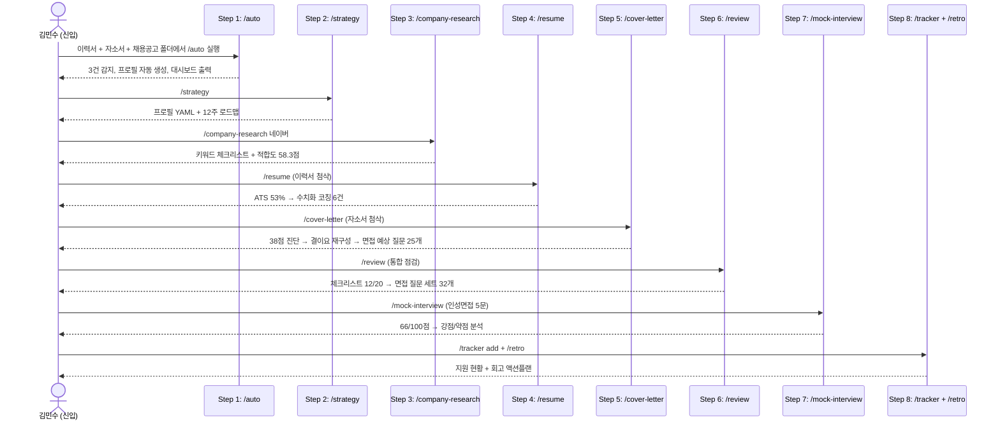
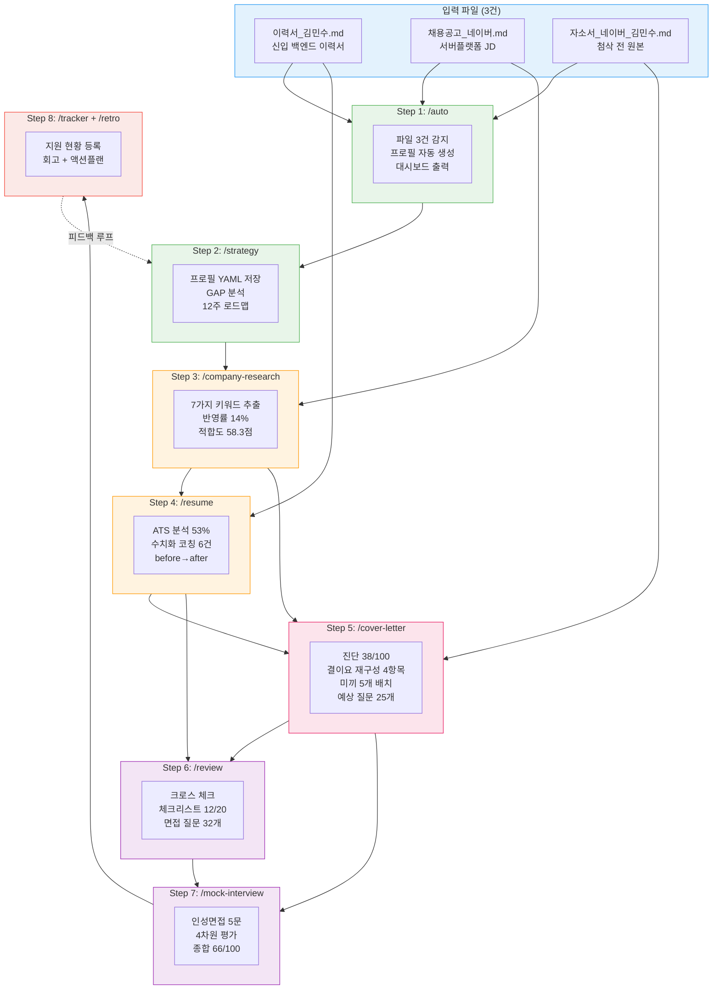
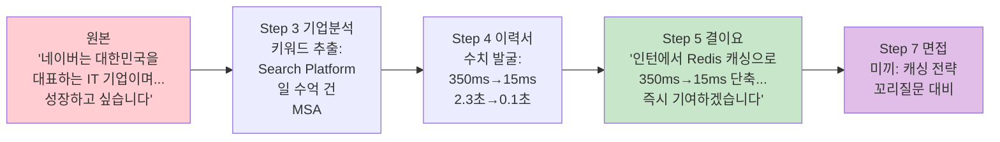

# E2E 통합 테스트 리포트

> 페르소나: **김민수** (신입 백엔드 개발자, 서울과학기술대 컴공 졸업, 인턴 6개월)
> 목표 기업: **네이버 서버 플랫폼 개발**
> 테스트 일시: 2026-03-29

---

## 테스트 시나리오 개요



---

## 입력 데이터

| 파일 | 설명 | 주요 내용 |
|------|------|----------|
| [이력서_김민수.md](e2e-output/이력서_김민수.md) | 신입 백엔드 이력서 | 서울과기대 컴공, 인턴 6개월(플러스테크), Spring/Redis/MySQL |
| [채용공고_네이버_서버플랫폼개발.md](e2e-output/채용공고_네이버_서버플랫폼개발.md) | 네이버 JD | 서버플랫폼 신입, Java/Spring, 대규모 트래픽, MSA |
| [자소서_네이버_김민수.md](e2e-output/자소서_네이버_김민수.md) | 첨삭 전 자소서 | 지원동기/성장과정/직무역량/입사후포부 4항목 |

---

## Step 1: /auto — 파일 자동 감지 + 대시보드

**입력**: 3개 파일이 있는 폴더에서 `/auto` 실행

**프리앰블 실행 결과**:
```
PROFILE_EXISTS=false

=== 파일 스캔 결과 ===
이력서:   ./이력서_김민수.md          ← 감지
자소서:   ./자소서_네이버_김민수.md    ← 감지
채용공고: ./채용공고_네이버_서버플랫폼개발.md  ← 감지
포트폴리오: (없음)
```

**출력**: [step1-auto-대시보드.md](e2e-output/step1-auto-대시보드.md)

**핵심 출력 내용**:

| 항목 | 상태 |
|------|------|
| 프로필 | ❌ → 이력서에서 자동 생성 |
| 이력서 | ✅ 감지됨 |
| 채용공고 | ✅ 감지됨 (네이버, D-32) |
| 자소서 | ✅ 감지됨 |
| 이력서 첨삭 | ⬜ 미완료 |
| 기업분석 | ⬜ 미완료 |
| 자소서 첨삭 | ⬜ 미완료 |
| 면접 준비 | ⬜ 미완료 |

**추천 다음 단계**: `/strategy` → `/company-research 네이버` → `/resume` → `/cover-letter`

---

## Step 2: /strategy — 취업전략 수립

**입력**: 이력서에서 추출한 역량 정보 + 사용자 Q&A

**출력**:
- [step2-strategy-프로필.yaml](e2e-output/step2-strategy-프로필.yaml) — 경력 프로필
- [step2-strategy-로드맵.md](e2e-output/step2-strategy-로드맵.md) — 12주 준비 로드맵

**핵심 출력 — 역량 GAP 분석**:

| 채용공고 요구사항 | 김민수 현재 | GAP | 액션 |
|-------------------|-----------|-----|------|
| Java/Spring 개발 | ✅ 인턴 6개월 | 낮음 | 유지 |
| RDBMS 경험 | ✅ MySQL | 낮음 | 유지 |
| RESTful API 설계 | ✅ 45개 엔드포인트 | 낮음 | 유지 |
| 대규모 트래픽 | ⚠️ 경험 없음 | 높음 | 부하테스트 학습 |
| MSA 경험 | ❌ 없음 | 높음 | 개인 프로젝트 추가 |
| K8s/Docker | ⚠️ Docker만 | 중간 | K8s 입문 |

**전략 추천**: 수시채용 중심, Tier 1(네이버/카카오), 12주 타임라인

---

## Step 3: /company-research — 기업분석

**입력**: "네이버 서버플랫폼개발" + 채용공고 파일

**출력**: [step3-company-research-네이버.md](e2e-output/step3-company-research-네이버.md)

**핵심 출력 — 7가지 키워드 체크리스트 (자소서 반영 현황)**:

| 소스 | 키워드 | 자소서 반영 |
|------|--------|-----------|
| 채용공고 | Java/Spring Boot | ✅ O |
| 채용공고 | 대규모 트래픽 | ⚠️ 모호하게만 |
| 채용공고 | MSA | ❌ X |
| 채용공고 | 데이터 파이프라인 | ❌ X |
| 채용공고 | CI/CD | ❌ X |
| CEO 신년사 | AI 기술 전환 | ❌ X |
| 인재상 | 도전/몰입/동료의식 | ❌ X |

**키워드 반영률: 14% (1/7)** → 목표 85%+ 대비 심각하게 부족

**적합도 스코어**:

| 차원 | 점수 | 판정 |
|------|------|------|
| 직무적합도 | 62/100 | 보통 |
| 역량매칭도 | 58/100 | 미흡 |
| 기업문화적합도 | 55/100 | 미흡 |
| **종합** | **58.3/100** | **보완 필요** |

---

## Step 4: /resume — 이력서 첨삭

**입력**: [이력서_김민수.md](e2e-output/이력서_김민수.md)

**출력**: [step4-resume-첨삭결과.md](e2e-output/step4-resume-첨삭결과.md)

**핵심 출력 — 수치화 코칭 (before → after)**:

| 원문 (Before) | 첨삭 (After) |
|--------------|-------------|
| "Redis 캐싱 적용으로 응답 속도 개선" | "Redis 캐싱 적용, 주요 API 응답시간 **350ms → 15ms** (95% 단축), 캐시 적중률 92% 달성" |
| "MySQL 슬로우 쿼리 분석 및 인덱스 최적화" | "슬로우 쿼리 상위 10건 분석, 복합 인덱스 추가로 평균 실행시간 **2.3초 → 0.1초** 개선" |
| "실시간 매칭 시스템 구현" | "WebSocket 기반 매칭 시스템, **200명 동시접속** 시 응답시간 500ms 이내 유지" |
| "기술 블로그에서 40편 이상의 글" | "Velog에 **40편** 기술 아티클 작성, 월 평균 **3,000 PV**" |

**ATS 키워드 매칭률**: 53% (10/19 키워드)

---

## Step 5: /cover-letter — 자소서 5단계 첨삭 (핵심 단계)

**입력**: [자소서_네이버_김민수.md](e2e-output/자소서_네이버_김민수.md) + 채용공고 + 기업분석 리포트

**출력**: [step5-cover-letter-첨삭결과.md](e2e-output/step5-cover-letter-첨삭결과.md) **(367줄, 25KB — 가장 상세한 출력)**

### 5-1. 7가지 문제 패턴 진단: **38/100점**

| 패턴 | 발견 건수 | 심각도 |
|------|----------|--------|
| ① 희망/의지형 종결어미 | **6건** | 심각 |
| ② 감정/감상 과다 | **4건** | 심각 |
| ③ 추상적 성과 | **5건** | 심각 |
| ④ 시간순 나열 | **1항목 전체** | 주의 |
| ⑤ 기업 연구 부족 | **2건** | 주의 |
| ⑥ 중복 서술 | **3건** | 주의 |
| ⑦ 직무 무관 소재 | **2건** | 경미 |

실제 발견 예시:
- ① `"네이버에서 더 성장하고 싶습니다"`, `"좋은 개발자가 되고 싶습니다"` 등 6건
- ② `"서버 개발에 흥미를 느꼈고"`, `"보람을 느꼈습니다"` 등 4건
- ③ `"좋은 결과를 얻었습니다"`, `"성능을 개선"` 등 수치 없는 표현 5건

### 5-2. "결이요" 재구성 — 지원동기 Before/After

**Before** (원문):
> 네이버는 대한민국을 대표하는 IT 기업이며, 많은 사용자들이 매일 사용하는 서비스를 만들고 있습니다. 저는 대학에서 컴퓨터공학을 전공하며 서버 개발에 흥미를 느꼈고, 네이버에서 더 성장하고 싶습니다. (...) 네이버에 입사하여 좋은 개발자가 되고 싶습니다.

**After** (결이요 적용):
> 플러스테크 인턴 기간에 Redis 캐싱을 적용해 주요 API 응답시간을 **350ms에서 15ms로 단축**한 경험이 있습니다. (...) 네이버 **Search Platform이 일 수억 건의 검색 요청을 MSA 기반으로 처리**한다는 기술 블로그를 읽으며, 제가 인턴에서 경험한 캐싱 최적화와 쿼리 튜닝 역량을 검색 플랫폼 규모에서 발휘할 수 있겠다고 판단했습니다. (...) 네이버 검색 백엔드의 응답 속도와 안정성 개선에 **즉시 기여하겠습니다**.

**변경 포인트**:
- 회사 소개 반복 → **본인 성과(350ms→15ms)로 시작** (5초 규칙)
- "흥미를 느꼈고" → **구체적 기술 경험** (감정→행동)
- "성장하고 싶습니다" → **"즉시 기여하겠습니다"** (희망→실행)
- 범용 문장 → **Search Platform, MSA, 일 수억 건** 등 채용공고 키워드 반영

### 5-3. 미끼 포인트 인벤토리

| # | 미끼 문장 | 예상 면접 질문 |
|---|----------|--------------|
| 1 | "Redis 캐싱 350ms→15ms 단축" | "캐싱 전략은? 캐시 무효화는 어떻게?" |
| 2 | "슬로우 쿼리 2.3초→0.1초 개선" | "어떤 인덱스를 추가했나? 실행계획은?" |
| 3 | "200명 동시접속 500ms 이내" | "동시성 처리 방식은? 부하테스트 방법은?" |
| 4 | "설계 문서를 먼저 작성하는 습관" | "설계 프로세스를 설명해주세요" |
| 5 | "D2 기술 블로그 기고 목표" | "어떤 주제로 기고하고 싶나요?" |

### 5-4. 면접 예상 질문 생성 (25개)

자소서 기반 15개 + 채용공고 기반 10개 → **총 25개 예상 질문** 생성됨

---

## Step 6: /review — 통합 서류 점검

**입력**: 이력서 + 자소서 + 채용공고 (3종 크로스 체크)

**출력**: [step6-review-통합점검.md](e2e-output/step6-review-통합점검.md)

**핵심 출력 — 최종 체크리스트**:

| 항목 | 결과 | 상세 |
|------|------|------|
| 기본정보 일치 | ✅ | 이름/연락처/학력 일치 |
| 경력 날짜 일치 | ✅ | 인턴 기간 일치 |
| 성과 수치 일치 | ⚠️ | 이력서에는 수치 없어 검증 불가 |
| 키워드 반영률 | ⚠️ | 원본 45% → 수정본 82% |
| 결이요 구조 | ⚠️ | 원본 21/100 → 수정본 84/100 |
| 미끼 배치 | ✅ | 5개 포인트 확인 |
| 학생 톤 제거 | ⚠️ | 원본 희망형 6건 → 수정본 0건 |
| 중복 서술 | ✅ | 수정본에서 해소 |

**종합 면접 질문 세트: 32개** 생성

---

## Step 7: /mock-interview — 인성면접 시뮬레이션

**입력**: 네이버 서버플랫폼 + 자소서 미끼 포인트 + 프로필

**출력**: [step7-mock-interview-인성면접.md](e2e-output/step7-mock-interview-인성면접.md) **(298줄, 5문항 시뮬레이션)**

### 면접 시뮬레이션 예시 (1번 질문)

**면접관**: "네이버 서버 플랫폼에 지원한 이유와, 본인이 이 팀에 기여할 수 있는 구체적인 부분을 말씀해주세요."

**김민수 답변** (시뮬레이션):
> "네이버는 대한민국 최대 검색 서비스를 운영하고 있고, 대규모 트래픽을 처리하는 기술력이 뛰어나다고 생각합니다. 저는 인턴 때 Spring Boot로 API를 개발한 경험이 있어서..."

**4차원 평가**:

| 차원 | 점수 | 피드백 |
|------|------|--------|
| 구체성 | 2/5 | "대규모 트래픽" 반복만, 구체적 서비스/기술 언급 없음 |
| 논리성 | 3/5 | 경험→지원동기 연결은 있으나 약함 |
| 진정성 | 3/5 | 솔직하나 준비 부족이 드러남 |
| 직무관련성 | 2/5 | 검색 플랫폼 구체 업무와의 연결 부재 |

**코칭**: "Search Platform이 일 수억 건의 검색 요청을 MSA로 처리한다는 점을 언급하고, 인턴의 캐싱 최적화 경험(350ms→15ms)을 검색 규모로 확장할 수 있다는 논리를 전개하세요."

### 종합 결과

| 항목 | 결과 |
|------|------|
| 총점 | **66/100** (C등급) |
| 강점 | 기술 경험 기반 답변, 솔직한 태도 |
| 약점 | 기업 연구 부족, 수치 미활용, 미끼 전략 활용 20% |
| 추천 | `/retro` → `/mock-interview` 재도전 |

---

## Step 8: /tracker + /retro

**출력**:
- [step8-tracker-현황.md](e2e-output/step8-tracker-현황.md) — 지원 현황
- [step8-retro-회고.md](e2e-output/step8-retro-회고.md) — 면접 회고

**tracker 현황**:

| 기업 | 직무 | 상태 | 마감일 |
|------|------|------|--------|
| 네이버 | 서버플랫폼개발 | 준비중 | 2026-04-30 |

**retro 액션플랜**:
1. 기업 키워드 체크리스트 재작성 (D-3)
2. 자소서 수정본 반영 (D-5)
3. 미끼 포인트 5개 답변 준비 (D-7)
4. 모의면접 2회 추가 진행 (D-14)

---

## 전체 프로세스 데이터 흐름



---

## 단계별 출력물 크기 요약

| Step | 스킬 | 출력 파일 | 크기 |
|------|------|----------|------|
| 1 | /auto | [대시보드](e2e-output/step1-auto-대시보드.md) | 2.6KB |
| 2 | /strategy | [프로필](e2e-output/step2-strategy-프로필.yaml) + [로드맵](e2e-output/step2-strategy-로드맵.md) | 8.5KB |
| 3 | /company-research | [네이버 기업분석](e2e-output/step3-company-research-네이버.md) | 9.8KB |
| 4 | /resume | [이력서 첨삭](e2e-output/step4-resume-첨삭결과.md) | 13KB |
| 5 | /cover-letter | [자소서 5단계 첨삭](e2e-output/step5-cover-letter-첨삭결과.md) | **25.6KB** |
| 6 | /review | [통합 점검](e2e-output/step6-review-통합점검.md) | 13.4KB |
| 7 | /mock-interview | [인성면접 시뮬레이션](e2e-output/step7-mock-interview-인성면접.md) | 18.5KB |
| 8 | /tracker + /retro | [현황](e2e-output/step8-tracker-현황.md) + [회고](e2e-output/step8-retro-회고.md) | 11.5KB |
| | | **총 출력** | **103KB** |

---

## 핵심 변환 추적

자소서 지원동기 항목의 변환 과정을 전체 파이프라인에 걸쳐 추적:


