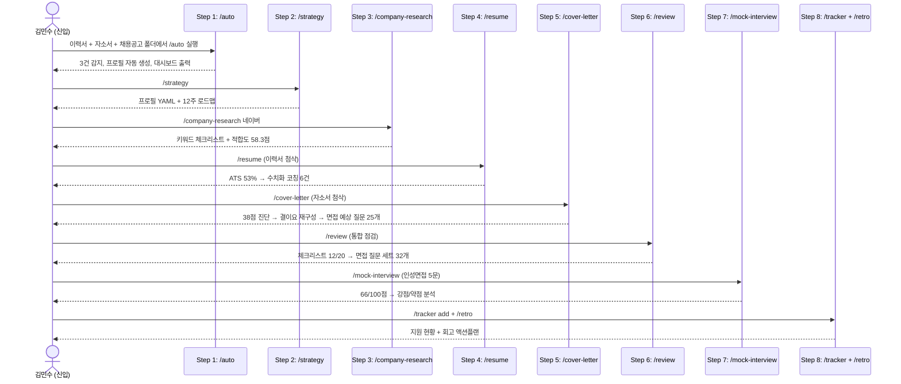
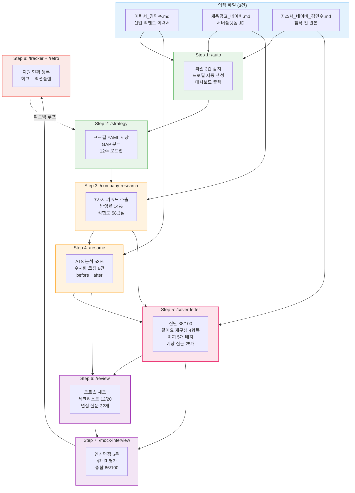
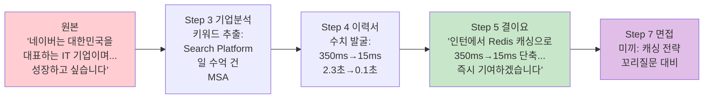

# E2E 통합 테스트 리포트

## 2026-09-03 — v1.0 헤드리스 실측 (스킬 eval 체계, U-16)

> 아래 2026-03 리포트는 v0.3 시점의 페르소나 서사 기록이다. v0.4.0~v1.0 에서 프리앰블·references 분할·
> 결정적 스크립트 계층이 도입되어 점수 체계와 흐름이 바뀌었으므로, 현재 동작의 근거는 이 절의 실측이다.
> 실행 방법: `REPO=<repo> bash test/run-evals.sh --tier gate|periodic|e2e` (격리 HOME, `claude -p --permission-mode auto`, 모델 sonnet).

### gate (결정적 판정, 5케이스) — 수정 후 5/5 통과

| 스킬 | 케이스 | 판정 | 확인한 것 |
|---|---|---|---|
| auto | auto-gate-file-detection | PASS | 이력서·자소서·채용공고 3종 감지, `references/cases.md` Read, telemetry append |
| cover-letter | cover-letter-gate-diagnosis | PASS | 작업 폴더의 자소서 파일을 스스로 Read(Phase 0 입력 확보), 결이요 진단, `references/review-steps.md` Read |
| experience-bank | expbank-gate-single-card | PASS | `jobstack-exp.mjs add` 호출로 카드 저장 |
| resume | resume-gate-ats-grade | PASS | `jobstack-ats-match --keywords --doc` 호출, 매칭률·등급 A·80% 출력 |
| tracker | tracker-gate-v1-migration-list | PASS | v1 한글 상태 파일을 스크립트가 정규화해 목록 출력 |

1차 실행에서는 3/5 였다 — cover-letter 가 폴더의 파일을 찾지 않고 되물었고(스킬 Phase 0 에 입력 확보 규칙 추가), resume 케이스는 CLI 인자 지시 프롬프트 때문에 Skill 대신 셸 탐색으로 흘러 턴 상한을 넘겼다(프롬프트를 `/resume …` 로 교정). 재실행 5/5.

### periodic·e2e (LLM 채점 병행, 각 5케이스) — 재실행 periodic 3/5 · e2e 3/5

| tier | 스킬 | 케이스 | 판정 | 실패 사유·관찰 |
|---|---|---|---|---|
| periodic | auto | auto-periodic-jd-paste-routing | PASS | JD 붙여넣기 → Case 2 라우팅, LLM PASS |
| periodic | cover-letter | cover-letter-periodic-keyword-rate | FAIL | 반영률을 손으로 계산 — `jobstack-ats-match` 미호출, `references/keyword-checklist.md` 미Read(LLM 은 PASS) |
| periodic | experience-bank | expbank-periodic-numberless-fallback | FAIL | 수치 폴백 5기준 대신 곧장 인터뷰 질문 — `[수치 확인 필요]` 미표기, experience-methods 미Read(LLM 은 PASS) |
| periodic | resume | resume-periodic-pii-sample-guard | PASS | 샘플 개인정보를 "예시"로 판별하고 확인 질문 |
| periodic | tracker | tracker-periodic-rejection-checklist | PASS | 불합격 전환 후 권리 체크리스트 안내(독립 실행 간 문구 편차 있음) |
| e2e | auto | auto-e2e-resume-handoff | FAIL | Case 대본(`references/cases.md`) 미Read, "확인 없이 진행" 지시에도 질문으로 멈춤(LLM FAIL) |
| e2e | cover-letter | cover-letter-e2e-new-draft-humanize | FAIL | 신규 작성 흐름이 Phase 1~2 질문에서 멈춰 초안·결이요·인간화 점검까지 못 감(LLM FAIL) |
| e2e | experience-bank | expbank-e2e-ai-usage-chain | PASS | `jobstack-exp.mjs add → validate → list` 체인, ai_usage 3필드 |
| e2e | resume | resume-e2e-jd-match-loop | PASS | JD 기준 첨삭 + `jobstack-ats-match` 매칭률 |
| e2e | tracker | tracker-e2e-add-update-stats-chain | PASS | add/update/stats 스크립트 호출 확인. 최종 답변이 stats 출력을 요약해 "전환율" 이 프로즈에서 빠졌으므로(도구 출력은 사용자 화면에 보임) 판정을 `must_output`(도구 결과 텍스트)으로 옮겨 통과 |

읽는 법: gate 는 게이트(결정적, 5/5), periodic·e2e 는 추세 관찰용이다. 남은 실패 4건 중 3건은 "질문에 답할 사람이 없는 헤드리스 1턴" 특성(auto·cover-letter e2e, experience-bank periodic)이고, 1건은 스킬 지시를 모델이 건너뛴 사례(cover-letter 반영률 스크립트 미호출)다 — 스킬 문구를 보강해 다음 실행에서 다시 본다. tracker 의 "출력 요약" 은 러너에 `must_output`(도구 결과 판정)을 추가해 해결했다. 총 15케이스 기준 11/15.

### 모델 비교 (U-19, tracker gate 케이스 2회씩)

| 모델 | 판정 | 턴 | 소요 | 비용(USD) |
|---|---|---|---|---|
| sonnet | PASS·PASS | 4·4 | 26s·26s | 0.19·0.18 |
| opus | PASS·PASS | 4·4 | 23s·29s | 0.94·0.47 |

판정·턴 수가 같고 비용만 2.5~5배 차이 — tracker 는 `model: sonnet`·`effort: low` 로 확정.

## 2026-09-06 — 16개 스킬 헤드리스 스모크 (PR #17 머지 전 로컬 실측)

> 실행 방법: 격리 HOME(`HOME`·`JOBSTACK_STATE_DIR` 을 임시 디렉토리로)에 `install.sh` 심링크 설치 → 작업 폴더에
> `test/sample-data/` 의 이력서·자소서·채용공고 3종 복사 → 스킬마다 `claude -p "/<스킬> …" --model sonnet --max-turns 8
> --permission-mode auto --output-format stream-json --verbose` 1케이스, 타임아웃 300초. auto 를 먼저 돌려 프로필을 만들고,
> 상태를 만드는 스킬(tracker·experience_bank) → 소비하는 스킬(ncs·retro·review) 순으로 4단계 병렬 실행.
> 헤드리스에는 AskUserQuestion 이 없어 프롬프트마다 "질문 없이 …까지만" 을 붙였다. 벽시계 약 10분(재실행 3건 별도 약 5분),
> 비용 약 6.5 USD(타임아웃된 1차 company_research 는 result 이벤트가 없어 제외).

| 스킬 | 케이스 | 턴 | 소요 | USD | 판정 | 확인한 것 |
|---|---|---|---|---|---|---|
| auto | `/auto` (인자 없음) | 7 | 64s | 0.24 | PASS | 3종 감지, `profiles/default.yaml` 생성, 예시값 패턴 개인정보를 `[확인 필요]` 로 보류, 공고 마감 지남 경고, 대시보드·선택지 제시 |
| tracker | 카카오 지원완료 추가 | 2 | 12s | 0.25 | PASS | `jobstack-tracker` 호출 한 번으로 add·현황 출력, `tracker/applications.jsonl` 생성 |
| experience_bank | 카드 1장 추가·검증 | 3 | 19s | 0.12 | PASS | `jobstack-exp.mjs add` → `validate`, `exp-20260906-01` 저장 |
| resume | 진단표까지 | 5 | 70s | 0.22 | PASS | `references/diagnosis.md` 만 Read(진행적 공개), 7대 실수 진단·등급, submitted/diagnosed 텔레메트리 |
| cover_letter | 진단까지 | 9 → 6 | 93s → 75s | 0.36 → 0.23 | 8턴 초과 → 16턴 예산 재실행 PASS | 마감 경고, 결이요 진단, `.last-review.md` 대비 재리뷰 감지(second_review 텔레메트리) |
| strategy | 프로필·공고 기준 GAP 까지 | 5 | 64s | 0.18 | PASS | 마감 경고 → 진단·중고신입 포지셔닝·GAP. 시장 조사 단계 전이라 researcher 미사용 |
| job_search | 수집 실패 시 진단 요약 | 11 | 74s | 0.27 | PASS(진단 경로) | `fetch-jobs.mjs` 4플랫폼 → 전부 실패(환경 한계, 아래) → `jobstack-fetch-diag` 집계·`jobstack-learn` source_blocked 4건, `references/fetch-flow.md` Read. 원인이 환경임을 스스로 판별 |
| portfolio | README 초안 1건 | 9 | 99s | 0.27 | PASS(DONE_WITH_CONCERNS) | 경험 카드 소비, `.md` + 뷰어 HTML 생성, 미확보 항목은 placeholder(날조 없음), 단축률 산식 명시 |
| salary | 연봉 협상 준비 | 1(+깨움 4) | 84s | 1.06 | PASS | researcher 4개를 한 응답에 발행(백그라운드) → 완료 깨움마다 result 이벤트 → 마지막 깨움에서 벤치마크·협상 리포트. 차단 소스는 "원문 미열람"/미확보 표기 |
| company_research | 네이버 백엔드 | 1차 300초 초과 / 재실행 11 | 313s | 1.66 | 부분 PASS | 아래 별도 기록 |
| ncs | 카드 → NCS 매핑 | 10 | 115s | 0.37 | PASS | `jobstack-exp.mjs list` 로 카드 읽기, `references/ncs-competencies.md`·experience-methods Read, 구 체계 기준·신 체계 `[2차]` 병기, `profiles/ncs-mapping_20260906.md` 저장 |
| retro | 지원 현황 통계까지 | 2 | 24s | 0.13 | PASS | `jobstack-tracker stats` + `jobstack-retro-stats`, 분모 1건이라 "통계적 의미 없음" 명시 |
| career_history | 경력기술서 초안 | 8 | 84s | 0.26 | PASS(DONE_WITH_CONCERNS) | 프로필·이력서·자소서·공고·포트폴리오 Read → 파일 저장, 미확보 항목 placeholder |
| scout_profile | 원티드 프로필 소개 | 3 | 61s | 0.19 | PASS | 저장된 사실만으로 작성, 수치 없는 항목 `[개선 수치 확인 필요]`, placeholder 개인정보 본문 제외 |
| mock_interview | 인성 첫 질문 1개 | 3 | 15s | 0.13 | PASS | `references/interview-flow.md`·`modes/personality.md` 만 Read, Q1/6 출력 후 정지 |
| review | 통합 리뷰 체크리스트까지 | 9 → 8 | 113s → 137s | 0.35 → 0.24 | 8턴 초과 → 16턴 예산 재실행 PASS | 1차에서도 `jobstack-defense-map.mjs` 로 방어맵 yaml·`.last-review.md` 생성. 재실행은 스냅샷 대비 재리뷰(second_review) |

**company_research 기록.** 1차(8턴·300초)는 researcher 7개를 한 응답에 백그라운드로 발행해 7건 모두 결과를 받았지만
(프록시 차단 소스는 미확보 처리), Phase 2~5 의 references 5개를 읽는 중 300초 벽시계를 넘겼다. 병렬 리서치 문구에
"한 응답에 함께 발행하고 결과를 기다린다" 를 추가한 재실행(10턴·480초)에서는 7개를 한 응답에 전경(`run_in_background: false`)
으로 발행해 한 턴에 결과를 모두 받고, `네이버-분석리포트.md`(재무·평판·뉴스·CEO 메시지·전형 방식, "(출처 미확보)" 15곳,
프록시 차단 배너)를 작업 폴더에 저장했다. 이후 캐시 저장·최종 요약 전에 10턴을 소진해 `error_max_turns` 로 끝났다(313초,
1.66 USD). 서브에이전트 7개 + references 5개 Read + 보고서·캐시 쓰기는 헤드리스 예산으로 12턴 이상·600초 이상이 필요하다.
문구 변경과 전경 호출의 인과는 1회 관찰이라 단정하지 않는다.

### 관찰과 환경 한계

- 결정적 스크립트 배선: tracker·experience_bank·ncs·retro·review·job_search 가 상태 파일을 손으로 쓰지 않고 `bin/` 스크립트를
  불렀다(위 표). `analytics/skill-usage.jsonl` 에 16개 스킬의 시작 이벤트와 detected/diagnosed/second_review 가 남았다.
- 진행적 공개: resume 는 diagnosis.md 만, mock_interview 는 interview-flow·personality 만 Read 했다. company_research 는
  Phase 2 진입 때 references 5개를 별도 턴으로 하나씩 읽어 턴을 4개 더 썼다 — 한 응답에 함께 Read 하도록 하는 문구는 후속 후보.
- 헤드리스에서 백그라운드 서브에이전트는 완료 깨움마다 `result` 이벤트를 하나씩 낸다(salary 5개). `test/run-evals.sh` 는
  마지막 이벤트를 판정에 쓰므로 최종 리포트를 보지만, 기록되는 `num_turns` 는 마지막 깨움 기준이다.
- `--max-turns 8` 은 cover_letter·review 에 부족했다(탐색 Bash·Read 가 많음). 16 이면 6·8턴으로 끝났다. eval 케이스는 기본
  10턴이므로 이 두 스킬의 케이스는 `expectations.max_turns` 를 12 이상으로 두는 편이 안전하다.
- 환경 한계(코드 결함 아님): 이 컨테이너의 프록시가 국내 채용·기업 사이트 접속을 거부해 WebFetch·스크레이핑이 막혔고(WebSearch 는
  됨), 사전 설치된 Playwright 브라우저(chromium 1194)가 `bin/` 의 playwright 가 요구하는 빌드(1234)와 달라 원티드·잡코리아·점핏
  수집이 `no_html` 로 끝났다. 사람인은 API 키 없이 scrape 폴백에서 403. 일반 환경에서는 `npx playwright install` 로 해결되며,
  실제 수집 성공은 이 실측에서 검증하지 못했다.
- 마감 지난 샘플 공고(2026.04.30)를 auto·cover_letter·strategy 가 모두 기준일 대비로 잡아냈다. 샘플 개인정보(홍길동·010-1234-5678)는
  auto 가 `[확인 필요]` 로, scout_profile 이 본문 제외로 처리했다.

## 2026-09-06 — STAR-R(입사 후 적용) 헤드리스 실측 (v1.1.0)

> 실행 방법: 격리 HOME 심링크 설치 → 카드 2장·네이버 캐시(요약 블록 + 키워드 체크리스트·'이미 팀원처럼' 화두) 시드, 첫 카드에 `jobstack-exp.mjs apply` 1건 시드 → `claude -p --model sonnet --max-turns 16 --permission-mode auto` 4케이스 순차. 계획·리뷰 기록은 `docs/plans/star-r-plan-2026-09.md` §8.

### gate eval (`test/run-evals.sh --tier gate --skill experience-bank`, 2회)

| 케이스 | 1차 | 수정 | 2차 |
|---|---|---|---|
| expbank-gate-single-card | FAIL — must_read: 카드 스키마 Read 를 건너뛰고 add | experience-bank Phase 4 에 "add 전 Read 를 건너뛰지 않는다" 명시 | PASS (6턴, 0.19 USD) |
| expbank-gate-star-r-apply(신규) | PASS (10턴, 0.23 USD) — apply 4플래그·`적용 저장됨`·§7 Read | 턴 예산 10 → 12 | PASS |

### 스킬 스모크 (격리 HOME, 카드 2장·네이버 캐시·apply 1건 시드, sonnet 16턴, 리뷰 반영 전 → 후)

| 스킬 | 케이스 | 1차 | 2차(5f335d1) | 확인한 것 |
|---|---|---|---|---|
| experience_bank | 카드 추가 + 네이버 입사 후 적용 연결 | 7턴 53s 0.24 PASS | 7턴 34s 0.19 PASS | add → §7 Read → `apply`(basis = 캐시 화두 원문) → validate → list. 2차는 카드 스키마 Read 포함 |
| company_research | 오늘 캐시 재사용 + Phase 5.5 | 6턴 48s 0.24 PASS | 8턴 59s 0.19 PASS | 웹 검색 없이 캐시 재사용, `list --json` → 미연결 카드 1장에 `apply`, 기존 연결 카드는 유지 |
| cover_letter | 네이버 지원동기 초안 | 8턴 111s 0.33 PASS | 13턴 119s 0.38 PASS | 1차: '요' 를 다짐형("기여하고 싶습니다")으로 바꾸고 '이' 에 "배웠습니다" 잔존. 2차: `list --company` → `list` 2단계, '요' 를 실행형 그대로, 다짐형·"배웠습니다" 0건 |
| mock_interview | 입사 후 적용 질문 1개 | 4턴 31s 0.18 PASS | 4턴 28s 0.16 PASS | 2차: 무필터 `list` → `list --company 네이버` → show, 카드 R·화두를 근거로 질문 |

관찰: 4케이스 모두 캐시·카드에 없는 기업 과제를 지어내지 않았고 `basis` 는 요약 블록·체크리스트 원문을 인용했다. 비용 합계 약 2.7 USD(스모크 2회 1.9, gate 2회 약 0.8).

3차(be3eb2a 2차 5관점 리뷰 반영 뒤, company_research 만 재실행 — Phase 5.5 의 Edit 명시 확인): 7턴 63s 0.28 USD, DONE_WITH_CONCERNS. 캐시 재사용 → §7 Read → `list --json` → 미연결 카드에 `apply`(basis = 체크리스트 최신기사 행·화두 원문, source = 캐시 파일), 캐시 파일은 수정 없음(mtime 유지), validate PASS. 캐시를 재사용한 세션에는 `네이버-분석리포트.md` 가 없어 §5 줄을 교체할 대상이 없었고 에이전트가 `find /` 로 찾은 뒤 우려사항으로 보고 → Phase 5.5 에 "리포트 파일을 만들지 않은 세션이면 §5 교체를 생략하고 완료 상태에만 적는다" 문구 추가.

---

> 페르소나: **김민수** (신입 백엔드 개발자, 서울과학기술대 컴공 졸업, 인턴 6개월)
> 목표 기업: **네이버 서버 플랫폼 개발**
> 테스트 일시: 2026-03-29

---

## 테스트 시나리오 개요


```mermaid
sequenceDiagram
    actor 김민수 as 김민수 (신입)
    participant Auto as Step 1: /auto
    participant Strategy as Step 2: /strategy
    participant CR as Step 3: /company-research
    participant Resume as Step 4: /resume
    participant CL as Step 5: /cover-letter
    participant Review as Step 6: /review
    participant MI as Step 7: /mock-interview
    participant Track as Step 8: /tracker + /retro

    김민수->>Auto: 이력서 + 자소서 + 채용공고 폴더에서 /auto 실행
    Auto-->>김민수: 3건 감지, 프로필 자동 생성, 대시보드 출력

    김민수->>Strategy: /strategy
    Strategy-->>김민수: 프로필 YAML + 12주 로드맵

    김민수->>CR: /company-research 네이버
    CR-->>김민수: 키워드 체크리스트 + 적합도 58.3점

    김민수->>Resume: /resume (이력서 첨삭)
    Resume-->>김민수: ATS 53% → 수치화 코칭 6건

    김민수->>CL: /cover-letter (자소서 첨삭)
    CL-->>김민수: 38점 진단 → 결이요 재구성 → 면접 예상 질문 25개

    김민수->>Review: /review (통합 점검)
    Review-->>김민수: 체크리스트 12/20 → 면접 질문 세트 32개

    김민수->>MI: /mock-interview (인성면접 5문)
    MI-->>김민수: 66/100점 → 강점/약점 분석

    김민수->>Track: /tracker add + /retro
    Track-->>김민수: 지원 현황 + 회고 액션플랜
```

---

## 입력 데이터

| 파일 | 설명 | 주요 내용 |
|------|------|----------|
| [이력서_김민수.md](e2e-output/이력서_김민수.md) | 신입 백엔드 이력서 | 서울과기대 컴공, 인턴 6개월(플러스테크), Spring/Redis/MySQL |
| [채용공고_네이버_서버플랫폼개발.md](e2e-output/채용공고_네이버_서버플랫폼개발.md) | 네이버 JD | 서버플랫폼 신입, Java/Spring, 대규모 트래픽, MSA |
| [자소서_네이버_김민수.md](e2e-output/자소서_네이버_김민수.md) | 첨삭 전 자소서 | 지원동기/성장과정/직무역량/입사후포부 4항목 |

---

## Step 1: /auto — 파일 자동 감지 + 대시보드

**입력**: 3개 파일이 있는 폴더에서 `/auto` 실행

**프리앰블 실행 결과**:
```
PROFILE_EXISTS=false

=== 파일 스캔 결과 ===
이력서:   ./이력서_김민수.md          ← 감지
자소서:   ./자소서_네이버_김민수.md    ← 감지
채용공고: ./채용공고_네이버_서버플랫폼개발.md  ← 감지
포트폴리오: (없음)
```

**출력**: [step1-auto-대시보드.md](e2e-output/step1-auto-대시보드.md)

**핵심 출력 내용**:

| 항목 | 상태 |
|------|------|
| 프로필 | ❌ → 이력서에서 자동 생성 |
| 이력서 | ✅ 감지됨 |
| 채용공고 | ✅ 감지됨 (네이버, D-32) |
| 자소서 | ✅ 감지됨 |
| 이력서 첨삭 | ⬜ 미완료 |
| 기업분석 | ⬜ 미완료 |
| 자소서 첨삭 | ⬜ 미완료 |
| 면접 준비 | ⬜ 미완료 |

**추천 다음 단계**: `/strategy` → `/company-research 네이버` → `/resume` → `/cover-letter`

---

## Step 2: /strategy — 취업전략 수립

**입력**: 이력서에서 추출한 역량 정보 + 사용자 Q&A

**출력**:
- [step2-strategy-프로필.yaml](e2e-output/step2-strategy-프로필.yaml) — 경력 프로필
- [step2-strategy-로드맵.md](e2e-output/step2-strategy-로드맵.md) — 12주 준비 로드맵

**핵심 출력 — 역량 GAP 분석**:

| 채용공고 요구사항 | 김민수 현재 | GAP | 액션 |
|-------------------|-----------|-----|------|
| Java/Spring 개발 | ✅ 인턴 6개월 | 낮음 | 유지 |
| RDBMS 경험 | ✅ MySQL | 낮음 | 유지 |
| RESTful API 설계 | ✅ 45개 엔드포인트 | 낮음 | 유지 |
| 대규모 트래픽 | ⚠️ 경험 없음 | 높음 | 부하테스트 학습 |
| MSA 경험 | ❌ 없음 | 높음 | 개인 프로젝트 추가 |
| K8s/Docker | ⚠️ Docker만 | 중간 | K8s 입문 |

**전략 추천**: 수시채용 중심, Tier 1(네이버/카카오), 12주 타임라인

---

## Step 3: /company-research — 기업분석

**입력**: "네이버 서버플랫폼개발" + 채용공고 파일

**출력**: [step3-company-research-네이버.md](e2e-output/step3-company-research-네이버.md)

**핵심 출력 — 7가지 키워드 체크리스트 (자소서 반영 현황)**:

| 소스 | 키워드 | 자소서 반영 |
|------|--------|-----------|
| 채용공고 | Java/Spring Boot | ✅ O |
| 채용공고 | 대규모 트래픽 | ⚠️ 모호하게만 |
| 채용공고 | MSA | ❌ X |
| 채용공고 | 데이터 파이프라인 | ❌ X |
| 채용공고 | CI/CD | ❌ X |
| CEO 신년사 | AI 기술 전환 | ❌ X |
| 인재상 | 도전/몰입/동료의식 | ❌ X |

**키워드 반영률: 14% (1/7)** → 목표 85%+ 대비 심각하게 부족

**적합도 스코어**:

| 차원 | 점수 | 판정 |
|------|------|------|
| 직무적합도 | 62/100 | 보통 |
| 역량매칭도 | 58/100 | 미흡 |
| 기업문화적합도 | 55/100 | 미흡 |
| **종합** | **58.3/100** | **보완 필요** |

---

## Step 4: /resume — 이력서 첨삭

**입력**: [이력서_김민수.md](e2e-output/이력서_김민수.md)

**출력**: [step4-resume-첨삭결과.md](e2e-output/step4-resume-첨삭결과.md)

**핵심 출력 — 수치화 코칭 (before → after)**:

| 원문 (Before) | 첨삭 (After) |
|--------------|-------------|
| "Redis 캐싱 적용으로 응답 속도 개선" | "Redis 캐싱 적용, 주요 API 응답시간 **350ms → 15ms** (95% 단축), 캐시 적중률 92% 달성" |
| "MySQL 슬로우 쿼리 분석 및 인덱스 최적화" | "슬로우 쿼리 상위 10건 분석, 복합 인덱스 추가로 평균 실행시간 **2.3초 → 0.1초** 개선" |
| "실시간 매칭 시스템 구현" | "WebSocket 기반 매칭 시스템, **200명 동시접속** 시 응답시간 500ms 이내 유지" |
| "기술 블로그에서 40편 이상의 글" | "Velog에 **40편** 기술 아티클 작성, 월 평균 **3,000 PV**" |

**ATS 키워드 매칭률**: 53% (10/19 키워드)

---

## Step 5: /cover-letter — 자소서 5단계 첨삭 (핵심 단계)

**입력**: [자소서_네이버_김민수.md](e2e-output/자소서_네이버_김민수.md) + 채용공고 + 기업분석 리포트

**출력**: [step5-cover-letter-첨삭결과.md](e2e-output/step5-cover-letter-첨삭결과.md) **(367줄, 25KB — 가장 상세한 출력)**

### 5-1. 7가지 문제 패턴 진단: **38/100점**

| 패턴 | 발견 건수 | 심각도 |
|------|----------|--------|
| ① 희망/의지형 종결어미 | **6건** | 심각 |
| ② 감정/감상 과다 | **4건** | 심각 |
| ③ 추상적 성과 | **5건** | 심각 |
| ④ 시간순 나열 | **1항목 전체** | 주의 |
| ⑤ 기업 연구 부족 | **2건** | 주의 |
| ⑥ 중복 서술 | **3건** | 주의 |
| ⑦ 직무 무관 소재 | **2건** | 경미 |

실제 발견 예시:
- ① `"네이버에서 더 성장하고 싶습니다"`, `"좋은 개발자가 되고 싶습니다"` 등 6건
- ② `"서버 개발에 흥미를 느꼈고"`, `"보람을 느꼈습니다"` 등 4건
- ③ `"좋은 결과를 얻었습니다"`, `"성능을 개선"` 등 수치 없는 표현 5건

### 5-2. "결이요" 재구성 — 지원동기 Before/After

**Before** (원문):
> 네이버는 대한민국을 대표하는 IT 기업이며, 많은 사용자들이 매일 사용하는 서비스를 만들고 있습니다. 저는 대학에서 컴퓨터공학을 전공하며 서버 개발에 흥미를 느꼈고, 네이버에서 더 성장하고 싶습니다. (...) 네이버에 입사하여 좋은 개발자가 되고 싶습니다.

**After** (결이요 적용):
> 플러스테크 인턴 기간에 Redis 캐싱을 적용해 주요 API 응답시간을 **350ms에서 15ms로 단축**한 경험이 있습니다. (...) 네이버 **Search Platform이 일 수억 건의 검색 요청을 MSA 기반으로 처리**한다는 기술 블로그를 읽으며, 제가 인턴에서 경험한 캐싱 최적화와 쿼리 튜닝 역량을 검색 플랫폼 규모에서 발휘할 수 있겠다고 판단했습니다. (...) 네이버 검색 백엔드의 응답 속도와 안정성 개선에 **즉시 기여하겠습니다**.

**변경 포인트**:
- 회사 소개 반복 → **본인 성과(350ms→15ms)로 시작** (5초 규칙)
- "흥미를 느꼈고" → **구체적 기술 경험** (감정→행동)
- "성장하고 싶습니다" → **"즉시 기여하겠습니다"** (희망→실행)
- 범용 문장 → **Search Platform, MSA, 일 수억 건** 등 채용공고 키워드 반영

### 5-3. 미끼 포인트 인벤토리

| # | 미끼 문장 | 예상 면접 질문 |
|---|----------|--------------|
| 1 | "Redis 캐싱 350ms→15ms 단축" | "캐싱 전략은? 캐시 무효화는 어떻게?" |
| 2 | "슬로우 쿼리 2.3초→0.1초 개선" | "어떤 인덱스를 추가했나? 실행계획은?" |
| 3 | "200명 동시접속 500ms 이내" | "동시성 처리 방식은? 부하테스트 방법은?" |
| 4 | "설계 문서를 먼저 작성하는 습관" | "설계 프로세스를 설명해주세요" |
| 5 | "D2 기술 블로그 기고 목표" | "어떤 주제로 기고하고 싶나요?" |

### 5-4. 면접 예상 질문 생성 (25개)

자소서 기반 15개 + 채용공고 기반 10개 → **총 25개 예상 질문** 생성됨

---

## Step 6: /review — 통합 서류 점검

**입력**: 이력서 + 자소서 + 채용공고 (3종 크로스 체크)

**출력**: [step6-review-통합점검.md](e2e-output/step6-review-통합점검.md)

**핵심 출력 — 최종 체크리스트**:

| 항목 | 결과 | 상세 |
|------|------|------|
| 기본정보 일치 | ✅ | 이름/연락처/학력 일치 |
| 경력 날짜 일치 | ✅ | 인턴 기간 일치 |
| 성과 수치 일치 | ⚠️ | 이력서에는 수치 없어 검증 불가 |
| 키워드 반영률 | ⚠️ | 원본 45% → 수정본 82% |
| 결이요 구조 | ⚠️ | 원본 21/100 → 수정본 84/100 |
| 미끼 배치 | ✅ | 5개 포인트 확인 |
| 학생 톤 제거 | ⚠️ | 원본 희망형 6건 → 수정본 0건 |
| 중복 서술 | ✅ | 수정본에서 해소 |

**종합 면접 질문 세트: 32개** 생성

---

## Step 7: /mock-interview — 인성면접 시뮬레이션

**입력**: 네이버 서버플랫폼 + 자소서 미끼 포인트 + 프로필

**출력**: [step7-mock-interview-인성면접.md](e2e-output/step7-mock-interview-인성면접.md) **(298줄, 5문항 시뮬레이션)**

### 면접 시뮬레이션 예시 (1번 질문)

**면접관**: "네이버 서버 플랫폼에 지원한 이유와, 본인이 이 팀에 기여할 수 있는 구체적인 부분을 말씀해주세요."

**김민수 답변** (시뮬레이션):
> "네이버는 대한민국 최대 검색 서비스를 운영하고 있고, 대규모 트래픽을 처리하는 기술력이 뛰어나다고 생각합니다. 저는 인턴 때 Spring Boot로 API를 개발한 경험이 있어서..."

**4차원 평가**:

| 차원 | 점수 | 피드백 |
|------|------|--------|
| 구체성 | 2/5 | "대규모 트래픽" 반복만, 구체적 서비스/기술 언급 없음 |
| 논리성 | 3/5 | 경험→지원동기 연결은 있으나 약함 |
| 진정성 | 3/5 | 솔직하나 준비 부족이 드러남 |
| 직무관련성 | 2/5 | 검색 플랫폼 구체 업무와의 연결 부재 |

**코칭**: "Search Platform이 일 수억 건의 검색 요청을 MSA로 처리한다는 점을 언급하고, 인턴의 캐싱 최적화 경험(350ms→15ms)을 검색 규모로 확장할 수 있다는 논리를 전개하세요."

### 종합 결과

| 항목 | 결과 |
|------|------|
| 총점 | **66/100** (C등급) |
| 강점 | 기술 경험 기반 답변, 솔직한 태도 |
| 약점 | 기업 연구 부족, 수치 미활용, 미끼 전략 활용 20% |
| 추천 | `/retro` → `/mock-interview` 재도전 |

---

## Step 8: /tracker + /retro

**출력**:
- [step8-tracker-현황.md](e2e-output/step8-tracker-현황.md) — 지원 현황
- [step8-retro-회고.md](e2e-output/step8-retro-회고.md) — 면접 회고

**tracker 현황**:

| 기업 | 직무 | 상태 | 마감일 |
|------|------|------|--------|
| 네이버 | 서버플랫폼개발 | 준비중 | 2026-04-30 |

**retro 액션플랜**:
1. 기업 키워드 체크리스트 재작성 (D-3)
2. 자소서 수정본 반영 (D-5)
3. 미끼 포인트 5개 답변 준비 (D-7)
4. 모의면접 2회 추가 진행 (D-14)

---

## 전체 프로세스 데이터 흐름


```mermaid
flowchart TB
    subgraph 입력["입력 파일 (3건)"]
        IN1["이력서_김민수.md<br/>신입 백엔드 이력서"]
        IN2["채용공고_네이버.md<br/>서버플랫폼 JD"]
        IN3["자소서_네이버_김민수.md<br/>첨삭 전 원본"]
    end

    subgraph step1["Step 1: /auto"]
        S1["파일 3건 감지<br/>프로필 자동 생성<br/>대시보드 출력"]
    end

    subgraph step2["Step 2: /strategy"]
        S2["프로필 YAML 저장<br/>GAP 분석<br/>12주 로드맵"]
    end

    subgraph step3["Step 3: /company-research"]
        S3["7가지 키워드 추출<br/>반영률 14%<br/>적합도 58.3점"]
    end

    subgraph step4["Step 4: /resume"]
        S4["ATS 분석 53%<br/>수치화 코칭 6건<br/>before→after"]
    end

    subgraph step5["Step 5: /cover-letter"]
        S5["진단 38/100<br/>결이요 재구성 4항목<br/>미끼 5개 배치<br/>예상 질문 25개"]
    end

    subgraph step6["Step 6: /review"]
        S6["크로스 체크<br/>체크리스트 12/20<br/>면접 질문 32개"]
    end

    subgraph step7["Step 7: /mock-interview"]
        S7["인성면접 5문<br/>4차원 평가<br/>종합 66/100"]
    end

    subgraph step8["Step 8: /tracker + /retro"]
        S8["지원 현황 등록<br/>회고 + 액션플랜"]
    end

    IN1 & IN2 & IN3 --> step1
    step1 --> step2
    step2 --> step3
    IN2 --> step3
    step3 --> step4
    IN1 --> step4
    step3 & step4 --> step5
    IN3 --> step5
    step4 & step5 --> step6
    step5 & step6 --> step7
    step7 --> step8
    step8 -.-> |"피드백 루프"| step2

    style 입력 fill:#E3F2FD,stroke:#2196F3
    style step1 fill:#E8F5E9,stroke:#4CAF50
    style step2 fill:#E8F5E9,stroke:#4CAF50
    style step3 fill:#FFF3E0,stroke:#FF9800
    style step4 fill:#FFF3E0,stroke:#FF9800
    style step5 fill:#FCE4EC,stroke:#E91E63
    style step6 fill:#F3E5F5,stroke:#9C27B0
    style step7 fill:#F3E5F5,stroke:#9C27B0
    style step8 fill:#FBE9E7,stroke:#F44336
```

---

## 단계별 출력물 크기 요약

| Step | 스킬 | 출력 파일 | 크기 |
|------|------|----------|------|
| 1 | /auto | [대시보드](e2e-output/step1-auto-대시보드.md) | 2.6KB |
| 2 | /strategy | [프로필](e2e-output/step2-strategy-프로필.yaml) + [로드맵](e2e-output/step2-strategy-로드맵.md) | 8.5KB |
| 3 | /company-research | [네이버 기업분석](e2e-output/step3-company-research-네이버.md) | 9.8KB |
| 4 | /resume | [이력서 첨삭](e2e-output/step4-resume-첨삭결과.md) | 13KB |
| 5 | /cover-letter | [자소서 5단계 첨삭](e2e-output/step5-cover-letter-첨삭결과.md) | **25.6KB** |
| 6 | /review | [통합 점검](e2e-output/step6-review-통합점검.md) | 13.4KB |
| 7 | /mock-interview | [인성면접 시뮬레이션](e2e-output/step7-mock-interview-인성면접.md) | 18.5KB |
| 8 | /tracker + /retro | [현황](e2e-output/step8-tracker-현황.md) + [회고](e2e-output/step8-retro-회고.md) | 11.5KB |
| | | **총 출력** | **103KB** |

---

## 핵심 변환 추적

자소서 지원동기 항목의 변환 과정을 전체 파이프라인에 걸쳐 추적:


```mermaid
flowchart LR
    A["원본<br/>'네이버는 대한민국을<br/>대표하는 IT 기업이며...<br/>성장하고 싶습니다'"]
    B["Step 3 기업분석<br/>키워드 추출:<br/>Search Platform<br/>일 수억 건<br/>MSA"]
    C["Step 4 이력서<br/>수치 발굴:<br/>350ms→15ms<br/>2.3초→0.1초"]
    D["Step 5 결이요<br/>'인턴에서 Redis 캐싱으로<br/>350ms→15ms 단축...<br/>즉시 기여하겠습니다'"]
    E["Step 7 면접<br/>미끼: 캐싱 전략<br/>꼬리질문 대비"]

    A --> B --> C --> D --> E

    style A fill:#FFCDD2
    style D fill:#C8E6C9
    style E fill:#E1BEE7
```
