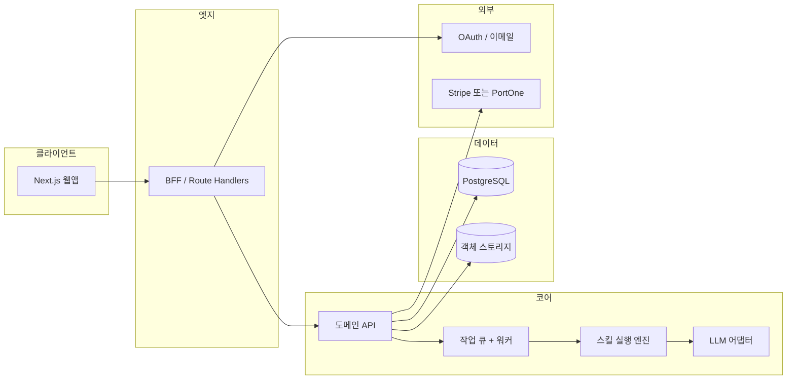

# JobStack 웹 SaaS 전환 — 기술 아키텍처 (통합본)

**문서 목적**: CLI·Markdown 스킬(13개) 기반 JobStack을 웹앱·SaaS로 옮기기 위한 **경계·데이터·연동·단계 로드맵**을 한 파일에 모은다.  
**범위**: 구현 코드가 아니라 **의사결정용 초안**(다이어그램·표·원칙).  
**경로**: `docs/WEB_SAAS_ARCHITECTURE.md`  

**관련 문서**: 상세 ERD·REST 스켈레톤은 [saas-phase2-erd-openapi.md](./saas-phase2-erd-openapi.md). 이전 파일명으로 작성된 Phase 1 초안은 [saas-architecture-phase1.md](./saas-architecture-phase1.md)에서 본 문서로 정리되었다.

---

## 0. SaaS 전환 Phase 1~4 매핑

웹 SaaS로의 전환을 **네 단계**로 나누었을 때, 각 단계의 초점과 산출물·연결 문서는 아래와 같다.

| Phase | 초점 | 주요 산출물 / 상태 |
|-------|------|---------------------|
| **1** | 시스템 경계, 프론트·BFF·API·작업 큐, 13 스킬 ↔ HTTP 매핑, `~/.jobstack/` → DB 방향, 인증·구독 웹훅 지점, `jobstack-view` 웹 대체, 리스크 | **본 문서** (초안 확정) |
| **2** | 논리 ERD, 핵심 REST 경로, 모노레포 패키지 역할 | [saas-phase2-erd-openapi.md](./saas-phase2-erd-openapi.md) |
| **3** | 전 스킬에 대한 Job 파이프라인·워커 안정화, 관측(로그·메트릭), 플랜별 쿼터·사용량 집계 운영 | 구현·런북 (추가 문서화 예정) |
| **4** | CLI ↔ 클라우드 양방향 동기, 팀/기업 계정, 규제·DSR·엔터프라이즈 요구 | 제품·보안 검토 후 범위 확정 |

**Phase 1에서 하지 않는 것**: DDL 전문, OpenAPI 전문, 프로덕션 SLO 수치 — Phase 2 이후 문서·코드로 내려간다.

---

## 1. 현행 요약 (CLI)

| 구분 | 내용 |
|------|------|
| 스킬 | 13개 Markdown 스킬 (`auto`, `strategy`, `company-research`, `job-search`, `ncs`, `salary`, `portfolio`, `tracker`, `resume`, `cover-letter`, `review`, `mock-interview`, `retro`) |
| 메타 | YAML frontmatter (`name`, `description`, `allowed-tools` 등) |
| 상태 | `~/.jobstack/` 이하 (`profiles/`, `tracker/`, `company-cache/`, `interview-history/`, `analytics/`, `sessions/`, `config.yaml`) |
| 뷰어 | `jobstack-view`: 로컬 `.md` → 단일 HTML(marked CDN) + 인쇄/PDF |
| 설정 | `bin/jobstack-config` → `config.yaml` 키-값 |

### 1.1 저장소 스냅샷 (본 설계 ↔ 코드)

| 항목 | 위치·비고 |
|------|-----------|
| 웹앱 | `apps/web` — `@jobstack/web` (Next.js App Router) |
| DB 패키지 | `packages/db` — Drizzle + PostgreSQL (`user` / `session` / `job` / `subscription` 등) |
| CLI 뷰어 | `bin/jobstack-view` — 웹에서는 §7 문서 상세·목록 UI로 대체 |
| 스킬 본문 | 리포지토리 루트 `{skill-name}/SKILL.md` |
| 결제 | PortOne 웹훅·구독 테이블 — [billing-portone.md](./billing-portone.md), `apps/web/app/api/webhooks/portone/` |
| 작업(Job) API | `apps/web/app/api/v1/jobs/` — 장기 실행(`job`, `job_event`); 스킬별 게이트 단계적 확장 |

제품 메시지·톤은 저장소 루트 [ETHOS.md](../ETHOS.md)와 맞춘다.

---

## 2. 목표 아키텍처 개요

**권장 방향 (Phase 1)**:

- **프론트**: React 기반 **Next.js**(App Router). 마케팅·온보딩은 SSR/SSG, 스킬 실행 UI는 클라이언트 상태 중심.
- **BFF**: Next **Route Handlers**로 세션 쿠키 검증·요청 정규화·Rate limit. 장기 실행·스트리밍이 커지면 별도 API 서버 분리 가능하나, 초기에는 모노리포 내 BFF+워커 패키지가 단순하다.
- **도메인 API**: 사용자·문서·구독·작업 상태는 **단일 PostgreSQL** 스키마로 모델링.

---

## 3. 스킬 실행 엔진 (개념)

“실행 엔진”은 HTTP 한 요청에 LLM 호출·파일 I/O·외부 API를 묶는 **오케스트레이션 계층**이다.

| 구성 요소 | 역할 |
|-----------|------|
| **스킬 레지스트리** | `skill_key` → 버전된 `SKILL.md` 본문(서버 저장). 롤백·감사를 위해 `skill_version` 레코드와 연결. |
| **컨텍스트 조립** | 사용자 `profiles`·`documents`·`applications` 등 DB 상태를 읽어 프롬프트 변수로 주입. CLI의 `~/.jobstack/` 파일이 이에 대응. |
| **작업(Job) 생성** | 동기 불가 작업은 `jobs` 행 생성 후 `202 Accepted` + `jobId`. 워커가 상태를 `job_events`로 기록. |
| **도구 정책** | YAML `allowed-tools`와 서버측 허용 목록을 교차 검증. 웹에서는 위험한 셸 도구 대신 제한된 API만 노출. |
| **LLM 어댑터** | 모델·토큰 상한은 플랜·스킬 정책에 따름. 산출물에 `skill_version`, `prompt_hash`(또는 동등 메타)를 남겨 재현성 확보. |

원칙: 스킬 Markdown은 **사용자에게 보이는 가이드**이자 **서버가 해석하는 실행 템플릿**의 이중 역할을 하되, 버전은 서버가 권위를 가진다.

---

## 4. 프론트엔드 / BFF / API 경계

| 레이어 | 책임 | 비책임 |
|--------|------|--------|
| **브라우저** | 폼·진행 UI·Markdown 미리보기·스트리밍 표시 | API 키·비즈니스 규칙 최종 판단 |
| **BFF** | 세션 검증, 요청 바디 정규화, CSRF/쿠키, 파일 업로드 presign | 프롬프트 최종 조립(워커/엔진) |
| **API/워커** | 스킬 실행 오케스트레이션, 큐잉, 과금 가능한 사용량 집계 | 정적 자산 |

**동기 vs 비동기**: 자소서·기업분석 등은 수분 단위일 수 있으므로, HTTP는 `202 Accepted` + `jobId` 폴링 또는 SSE/WebSocket을 기본 패턴으로 한다.

---

## 5. 스킬 → HTTP·작업 단위 매핑 전략

CLI의 `/skill-name` 의도를 웹에서는 **리소스 중심 REST** + 내부 `skill_key`로 매핑한다.

### 5.1 스킬별 대표 엔드포인트(초안)

| 스킬 키 | 사용자 기능 | HTTP(초안) | 비고 |
|---------|-------------|------------|------|
| `auto` | 대시보드·파일 감지 | `POST /v1/sessions/auto-scan` | 저장소 연동 시 |
| `strategy` | 전략·로드맵 | `POST /v1/plans` | 산출물: Plan 문서 |
| `company-research` | 기업분석 | `POST /v1/research/companies` | 캐시 키: `companyId`+날짜 |
| `job-search` | 채용 탐색 | `POST /v1/jobs/search` | 외부 검색 API 래핑 |
| `ncs` | NCS 매핑 | `POST /v1/profiles/{id}/ncs` | |
| `salary` | 연봉 | `POST /v1/salary/analyze` | |
| `portfolio` | 포트폴리오 | `POST /v1/documents/portfolio-review` | |
| `tracker` | 지원 현황 | `GET/POST /v1/applications` | JSONL → 테이블 |
| `resume` | 이력서 | `POST /v1/documents/resume` | 버전 관리 |
| `cover-letter` | 자소서 | `POST /v1/documents/cover-letter` | |
| `review` | 통합 리뷰 | `POST /v1/reviews` | 다중 문서 입력 |
| `mock-interview` | 모의면접 | `POST /v1/interviews/sessions` | 세션별 스트리밍 |
| `retro` | 회고 | `POST /v1/interviews/{id}/retro` | |

통합 Job 리소스: `GET/POST /api/v1/jobs` 등. 초기에는 `skillKey`별 게이트로 일부 스킬부터 연다.

**원칙**: URL에는 한국어 슬래시 명령이 아니라 **영문 리소스**를 쓴다.

---

## 6. 사용자 상태: `~/.jobstack/` → DB 방향

### 6.1 디렉터리·파일 → 논리 엔티티

| 현행 경로 | 내용 | DB 방향 (초안) |
|-----------|------|----------------|
| `profiles/default.yaml` | 사용자 프로필 | `profiles` (user_id, yaml/jsonb, version) |
| `tracker/applications.jsonl` | 지원 행렬 | `applications` 행 + 선택적 이벤트 로그 |
| `company-cache/*.md` | 기업분석 캐시 | `company_research_artifacts` |
| `interview-history/*.md` | 면접·회고 | `interview_sessions`, `retro_reports` |
| `analytics/skill-usage.jsonl` | 사용량 | `usage_events` (과금·쿼터) |
| `sessions/*` | 세션 PID 등 | 웹에서는 서버 세션/작업 ID로 대체 |
| `config.yaml` | 키-값 설정 | `user_settings` (JSONB) |

### 6.2 마이그레이션

- **신규 가입**: 빈 프로필·설정 행 생성.
- **CLI 사용자**: 가져오기 마법사로 YAML/JSONL/Markdown 업로드 → 검증 후 삽입.

---

## 7. 인증·구독 연동 지점

### 7.1 인증

- **OAuth**(Google 등) + **이메일 로그인**(매직 링크 또는 OTP)을 동일 `users`에 연결.
- 세션: **httpOnly 쿠키** + 서버 세션(Redis 선택) 또는 **JWT**(짧은 만료 + refresh).
- BFF에서만 쿠키 발급·갱신.

### 7.2 구독 (Stripe 또는 PortOne)

| 항목 | Stripe | PortOne(국내) |
|------|--------|----------------|
| 강점 | 글로벌 표준·웹훅 | 국내 PG·가입 UX |
| 연동 지점 | `POST /webhooks/stripe` | `POST /webhooks/portone` |
| 공통 저장 | `subscriptions`, `invoices` | 동일 |

**요약**: Stripe는 글로벌·장기 SaaS에, PortOne은 국내 단일 시장·로컬 결제에 유리한 경우가 많다. Phase 1에서는 `PaymentProvider` 추상화로 웹훅 페이로드를 정규화하고 구현체만 교체 가능하게 한다.

**결제 UI는 클라이언트 SDK**, **상태 확정은 웹훅만 신뢰**. 사용량 제한은 `usage_events`와 플랜 쿼터로 API 게이트.

---

## 8. `jobstack-view` 웹 대체안

| CLI 동작 | 웹 대체 |
|----------|---------|
| 로컬 `.md` → HTML + 브라우저 | **문서 상세 페이지**: Markdown 렌더 + CLI와 유사한 타이포·다크모드 토큰 |
| PDF(인쇄) | 브라우저 인쇄 + `@media print` |
| CDN `marked` | 번들 포함(CSP·오프라인) |

**MVP 화면**: 문서 상세(읽기 전용), 문서 목록, 인쇄/PDF 준비, (권장) 읽기 설정. 산출물은 **DB에 Markdown 저장**, 뷰어는 읽기 전용 렌더러로 통일.

---

## 9. 리스크·오픈 이슈

| 리스크 | 완화 |
|--------|------|
| LLM 비용·지연 | 큐·우선순위, 플랜별 모델/토큰 상한, 동기 API 타임아웃 |
| PII·이력서 | 암호화 at rest, 접근 감사, DSR 프로세스 |
| 외부 API ToS | 데이터 소스 어댑터·캐시 정책 명시 |
| 스킬 버전 vs 결과 불일치 | `skill_version`, `prompt_hash` 저장 |
| PortOne vs Stripe | `PaymentProvider` 추상화 |

**Phase 2 이후 검토**: 실시간 면접 음성, 팀/기업 계정, CLI 양방향 동기.

---

## 10. 산출물 체크리스트 (Phase 1 본 문서)

- [x] 프론트 / BFF / API / 작업 큐 경계
- [x] 스킬 실행 엔진 개념
- [x] 13 스킬 ↔ HTTP·작업 단위 매핑
- [x] `~/.jobstack/` → 테이블 방향
- [x] 인증·구독 웹훅 지점
- [x] `jobstack-view` 웹 대체
- [x] SaaS 전환 Phase 1~4 매핑
- [x] 리스크·오픈 이슈

---

**문서 버전**: 1.0 — [TSK-781](/TSK/issues/TSK-781)에서 통합본 파일명 확정; [TSK-800](/TSK/issues/TSK-800)에서 리포 커밋·CEO 제안용 초안으로 확정. `saas-architecture-phase1.md`는 호환용으로 유지한다.  
**다음 단계**: Phase 2 — [saas-phase2-erd-openapi.md](./saas-phase2-erd-openapi.md)
