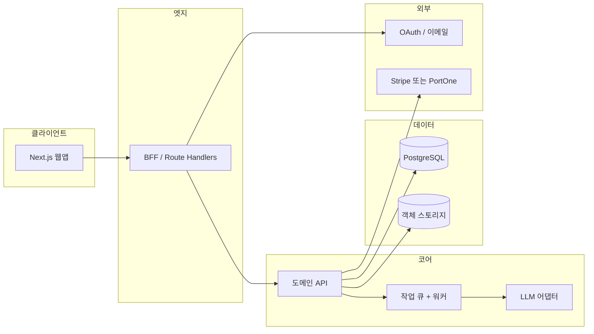

# JobStack 웹 SaaS 전환 — 기술 아키텍처 (Phase 1 초안)

**문서 목적**: CLI·Markdown 스킬 기반 JobStack을 웹앱·API로 옮기기 위한 경계·데이터·연동 지점을 한곳에 정리한다.  
**범위**: Phase 1은 구현 상세가 아니라 **의사결정에 필요한 초안**이다.  
**관련 저장소 경로**: 이 파일은 `docs/saas-architecture-phase1.md` 이다.

---

## 1. 현행 요약 (CLI)

| 구분 | 내용 |
|------|------|
| 스킬 | 13개 Markdown 스킬 (`auto`, `strategy`, `company-research`, `job-search`, `ncs`, `salary`, `portfolio`, `tracker`, `resume`, `cover-letter`, `review`, `mock-interview`, `retro`) |
| 메타 | YAML frontmatter (`name`, `description`, `allowed-tools` 등) |
| 상태 | `~/.jobstack/` 이하 디렉터리·파일 (`profiles/`, `tracker/`, `company-cache/`, `interview-history/`, `analytics/`, `sessions/`, `config.yaml`) |
| 뷰어 | `jobstack-view`: 로컬 `.md` → 단일 HTML(marked CDN) + 인쇄/PDF |
| 설정 | `bin/jobstack-config` → `config.yaml` 키-값 |

---

## 2. 목표 아키텍처 개요

**권장 방향 (Phase 1)**:

- **프론트**: React 기반 **Next.js**(App Router). 마케팅·온보딩은 SSR/SSG, 스킬 실행 UI는 클라이언트 상태 중심.
- **BFF**: Next **Route Handlers**(`app/api/...`)로 세션 쿠키 검증·요청 얇은 변환·Rate limit 프록시.  
  장기 실행·스트리밍이 필요하면 **별도 API 서버**(Fastify/Nest 등)로 분리 가능하나, 초기에는 **모노리포** 한 레포에서 BFF+워커 패키지로 나누는 편이 단순하다.
- **도메인 API**: 사용자·문서·구독·작업 상태는 **단일 PostgreSQL** 스키마로 일관되게 모델링.

---

## 3. 프론트엔드 / BFF / API 경계

| 레이어 | 책임 | 비책임 |
|--------|------|--------|
| **브라우저** | 폼·진행 UI·Markdown 미리보기·스트리밍 표시 | API 키·비즈니스 규칙 최종 판단 |
| **BFF** | 세션 검증, 요청 바디 정규화, CSRF/쿠키, 파일 업로드 presign | LLM 프롬프트 조립·토큰 계산(워커로 위임 가능) |
| **API/워커** | 스킬 실행 오케스트레이션, 큐잉, 청구 가능한 사용량 집계 | 정적 자산 |

**동기 vs 비동기**: 자소서·기업분석 등은 **수분 단위**가 될 수 있으므로, HTTP는 `202 Accepted` + `jobId` 폴링 또는 SSE/WebSocket으로 진행률을 반환하는 패턴을 기본으로 한다.

---

## 4. 스킬 → HTTP·작업 단위 매핑 전략

CLI에서는 `/skill-name`이 사용자 의도이고, 웹에서는 **리소스 중심 REST** + **내부 skill 키**로 매핑한다.

### 4.1 스킬별 대표 엔드포인트(초안)

| 스킬 키 | 사용자 기능 | HTTP(초안) | 비고 |
|---------|-------------|------------|------|
| `auto` | 대시보드·파일 감지 | `POST /v1/sessions/auto-scan` | 업로드 또는 저장소 연동 시 |
| `strategy` | 전략·로드맵 | `POST /v1/plans` | 산출물: Plan 문서 |
| `company-research` | 기업분석 | `POST /v1/research/companies` | 캐시 키: `companyId`+날짜 |
| `job-search` | 채용 탐색 | `POST /v1/jobs/search` | 외부 크롤/검색 API 래핑 |
| `ncs` | NCS 매핑 | `POST /v1/profiles/{id}/ncs` | |
| `salary` | 연봉 | `POST /v1/salary/analyze` | |
| `portfolio` | 포트폴리오 | `POST /v1/documents/portfolio-review` | |
| `tracker` | 지원 현황 | `GET/POST /v1/applications` | JSONL → 테이블 |
| `resume` | 이력서 | `POST /v1/documents/resume` | 버전 관리 |
| `cover-letter` | 자소서 | `POST /v1/documents/cover-letter` | |
| `review` | 통합 리뷰 | `POST /v1/reviews` | 다중 문서 입력 |
| `mock-interview` | 모의면접 | `POST /v1/interviews/sessions` | 세션별 스트리밍 |
| `retro` | 회고 | `POST /v1/interviews/{id}/retro` | |

**원칙**:

- URL에는 **한국어 슬래시 명령**이 아니라 **영문 리소스**를 쓴다.
- 스킬 `SKILL.md` 본문은 **서버 측 “실행 템플릿”**으로 저장하고, 버전 필드로 롤백 가능하게 한다.

---

## 5. 사용자 상태: `~/.jobstack/` → DB 방향

### 5.1 디렉터리·파일 → 논리 엔티티

| 현행 경로 | 내용 | DB 방향 (초안) |
|-----------|------|----------------|
| `profiles/default.yaml` | 사용자 프로필 | `profiles` 테이블 (user_id, yaml 또는 jsonb, version) |
| `tracker/applications.jsonl` | 지원 행렬 | `applications` 행 + 불변 이벤트 로그 선택 |
| `company-cache/*.md` | 기업분석 캐시 | `company_research_artifacts` (markdown text, company_key, created_at) |
| `interview-history/*.md` | 면접·회고 | `interview_sessions`, `retro_reports` |
| `analytics/skill-usage.jsonl` | 사용량 | `usage_events` (과금·쿼터에 직결) |
| `sessions/*` | 세션 PID 등 | 웹에서는 **서버 세션/작업 ID**로 대체 |
| `config.yaml` | 키-값 설정 | `user_settings` (key-value JSONB) |

### 5.2 마이그레이션

- **신규 가입**: 빈 프로필·설정 행 생성.
- **CLI 사용자**: 선택적 “가져오기” 마법사로 YAML/JSONL/Markdown 업로드 → 검증 후 삽입.

---

## 6. 인증·구독 연동 지점

### 6.1 인증

- **OAuth**(Google 등) + **이메일 로그인**(매직 링크 또는 OTP)을 동일 `users` 테이블에 연결.
- 세션: **httpOnly 쿠키** + 서버 측 세션 저장소(Redis 선택) 또는 **JWT**(짧은 만료 + refresh).
- BFF에서만 쿠키 발급·갱신을 수행하고, 순수 API는 `Authorization` 또는 내부 mTLS(후속)로 분리 가능.

### 6.2 구독 (Stripe 또는 PortOne)

| 항목 | Stripe | PortOne(국내) |
|------|--------|----------------|
| 강점 | 글로벌 표준, 문서·웹훅 풍부 | 국내 PG·가입 UX |
| 연동 지점 | `POST /webhooks/stripe` | `POST /webhooks/portone` |
| 공통 저장 | `subscriptions`(user_id, plan, status, current_period_end), `invoices` | 동일 |

**결제 UI는 클라이언트 SDK**, **상태 확정은 웹훅만 신뢰**한다.  
사용량 제한(스킬 호출 횟수)은 `usage_events`와 플랜별 쿼터를 조인해 API 게이트에서 차단.

---

## 7. `jobstack-view` 웹 대체안

| CLI 동작 | 웹 대체 |
|----------|---------|
| 로컬 `.md` → HTML + 브라우저 오픈 | **문서 상세 페이지**: 같은 Markdown 렌더(React: `react-markdown` 등) + **기존 CSS 토큰**(다크모드·Noto) 이식 |
| PDF 버튼(인쇄) | 브라우저 **인쇄 CSS**(`@media print`) 유지; 서버 PDF 생성은 후순위(비용·품질) |
| CDN `marked` | **번들에 포함**하여 CSP·오프라인 대응 |

**핵심**: 산출물은 **DB에 Markdown으로 저장**하고, 뷰어는 읽기 전용 렌더러로 통일한다.

---

## 8. 리스크·오픈 이슈

| 리스크 | 완화 |
|--------|------|
| LLM 비용·지연 | 큐 + 우선순위, 플랜별 모델/토큰 상한, 동기 API 타임아웃 |
| PII·이력서 데이터 | 암호화 at rest, 접근 감사, 삭제 요청(DSR) 프로세스 |
| 외부 검색·채용 API ToS | 별도 “데이터 소스” 어댑터 레이어, 캐시 정책 명시 |
| 스킬 버전과 저장 결과 불일치 | 문서에 `skill_version`, `prompt_hash` 저장 |
| PortOne vs Stripe 이원화 | 결제 **추상 인터페이스**(`PaymentProvider`)로 웹훅·고객 포털 통합 |

**Phase 2 이후에 결정할 것**: 실시간 면접 음성, 팀/기업 계정, 오프라인 CLI와의 양방향 동기.

---

## 9. 산출물 체크리스트 (본 Phase)

- [x] 프론트 / BFF / API / 작업 큐 경계 정의
- [x] 13 스킬 ↔ HTTP·작업 단위 매핑 표
- [x] `~/.jobstack/` → 테이블 방향
- [x] 인증·구독 웹훅 지점
- [x] `jobstack-view` 웹 대체 전략
- [x] 리스크·오픈 이슈

---

**문서 버전**: 0.1 (Phase 1)  
**다음 단계**: Phase 2 초안 — [saas-phase2-erd-openapi.md](./saas-phase2-erd-openapi.md) (ERD·REST 스켈레톤·모노레포 레이아웃).
