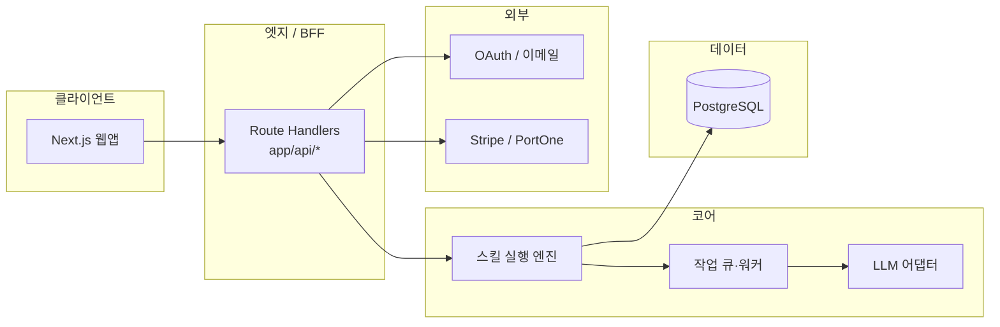

# JobStack CLI → 웹 SaaS 기술 아키텍처 초안

**문서 역할**: 웹·API·스킬 런타임·DB(`~/.jobstack/` 이전)·결제 연동 지점을 **한 파일**에서 빠르게 읽을 수 있는 기술 초안이다.  
**상세 통합본**: 경계·리스크·체크리스트까지 포함한 장문은 [WEB_SAAS_ARCHITECTURE.md](./WEB_SAAS_ARCHITECTURE.md)를 본다.  
**데이터/API 스켈레톤**: [saas-phase2-erd-openapi.md](./saas-phase2-erd-openapi.md).

---

## 1. 리더 플랜(TSK-822)과의 정합성

아래 **제품 Phase**는 Paperclip 이슈 문서 *JobStack CLI → 웹 SaaS 전환 플랜*과 동일한 번호·용어를 쓴다. 기술 문서 [WEB_SAAS_ARCHITECTURE.md](./WEB_SAAS_ARCHITECTURE.md)의 “Phase 1~4” 표와 **방향은 동일**하며, 제품 Phase 1은 “수직 슬라이스(스킬 1~2개)”까지를 포함한다.

| 제품 Phase | 초점 (리더 플랜) | 기술 산출물·저장소 대응 |
|------------|------------------|-------------------------|
| **1** | 웹 뼈대 + 인증 + 스킬 1~2개 수직 슬라이스 | `apps/web`(Next.js App Router), NextAuth Route Handlers, `packages/db`, 선택 스킬용 Job/세션 API |
| **2** | 나머지 스킬 포팅, 상태 DB화, `jobstack-view` 웹 뷰어 | 13 스킬 레지스트리·워커, 문서/트래커 UI, [saas-phase2-erd-openapi.md](./saas-phase2-erd-openapi.md) 반영 |
| **3** | 결제·플랜·게이팅 | Stripe 또는 PortOne, `subscriptions`·웹훅, `usage_events` 쿼터 |
| **4** | SEO·커뮤니티·레퍼럴 | 마케팅·정적 라우트·외부 연동(구현 범위는 제품 확정 후) |

**Vercel 배포와의 관계**: 공개 스테이징은 **Root Directory `apps/web`**, `apps/web/vercel.json`의 install/build가 모노레포 루트에서 Turbo로 `@jobstack/web`만 빌드한다. 운영자가 Vercel에 연결·`DATABASE_URL`·`AUTH_*`·OAuth 등을 넣기 전까지는 배포가 막힐 수 있으며, 그 절차·환경 변수 목록은 [vercel-monorepo.md](./vercel-monorepo.md)와 본 설계의 “배포 전제”가 같다(구현 코드와 충돌 없음).

---

## 2. 목표 타깃 아키텍처 (요약)

| 층 | 역할 | 비고 |
|----|------|------|
| **Web** | Next.js(App Router), 인증·결제 UI·대시보드·스킬 실행 화면 | 패키지 `@jobstack/web` |
| **API / BFF** | Route Handlers: 세션 검증, Job 생성·조회, 웹훅 수신 | 장기 실행은 `202` + `jobId` 패턴 |
| **Skill runtime** | Markdown `SKILL.md` + YAML frontmatter를 서버에서 버전 관리·치환·LLM 호출 | CLI와 동일 프롬프트 계약 |
| **Data** | 테넌트(사용자)별 Postgres: 프로필·문서·지원·작업·구독 | `~/.jobstack/` → 테이블/JSONB 이전 |
| **Billing** | Stripe 또는 PortOne | Phase 3, 웹훅만 최종 상태의 근거 |

---

## 3. 스킬 런타임 (개념)

| 구성 요소 | 역할 |
|-----------|------|
| **레지스트리** | `skill_key` → 버전된 `SKILL.md` |
| **컨텍스트 조립** | DB의 프로필·문서·지원 정보를 프롬프트 변수로 주입(CLI의 `~/.jobstack/` 대응) |
| **Job** | 동기 불가 작업은 `jobs` 행 + `job_events` 스트림 |
| **도구 정책** | `allowed-tools`와 서버 허용 목록 교차 검증; 웹에서는 셸 대신 제한 API |

---

## 4. API·엔드포인트 초안 (스킬 ↔ HTTP)

CLI의 `/skill-name` 의도를 **영문 리소스** REST로 매핑한다. 구현 단계에서는 통합 `Job` API로 수렴할 수 있다.

| skill_key | 사용자 기능 | HTTP(초안) |
|-----------|-------------|------------|
| `auto` | 대시보드·스캔 | `POST /v1/sessions/auto-scan` |
| `strategy` | 전략 | `POST /v1/plans` |
| `company-research` | 기업분석 | `POST /v1/research/companies` |
| `job-search` | 채용 탐색 | `POST /v1/jobs/search` |
| `ncs` | NCS 매핑 | `POST /v1/profiles/{id}/ncs` |
| `salary` | 연봉 | `POST /v1/salary/analyze` |
| `portfolio` | 포트폴리오 | `POST /v1/documents/portfolio-review` |
| `tracker` | 지원 현황 | `GET/POST /v1/applications` |
| `resume` | 이력서 | `POST /v1/documents/resume` |
| `cover-letter` | 자소서 | `POST /v1/documents/cover-letter` |
| `review` | 통합 리뷰 | `POST /v1/reviews` |
| `mock-interview` | 모의면접 | `POST /v1/interviews/sessions` |
| `retro` | 회고 | `POST /v1/interviews/{id}/retro` |

**이미 저장소에 있는 BFF 예시**: `GET/POST /api/v1/jobs` — 스킬별 `skillKey` 게이트를 단계적으로 확장.

---

## 5. `~/.jobstack/` → DB 이전

| 현행 경로 | DB 방향 (초안) |
|-----------|----------------|
| `profiles/*.yaml` | `profiles`(jsonb/yaml, version) |
| `tracker/applications.jsonl` | `applications` |
| `company-cache/*.md` | `company_research_artifacts` |
| `interview-history/*.md` | `interview_sessions` / `retro_reports` |
| `analytics/skill-usage.jsonl` | `usage_events` |
| `sessions/*` | 서버 세션·`job_id`로 대체 |
| `config.yaml` | `user_settings` |

신규 가입은 빈 프로필·설정 생성; CLI 사용자는 파일 업로드 가져오기로 이전.

---

## 6. 인증·결제 연동 지점

- **인증**: OAuth(Google 등) + 이메일(매직 링크 등) → 동일 `users`; 세션은 httpOnly 쿠키(+ 서버 저장소 또는 짧은 JWT). NextAuth 경로: `app/api/auth/[...nextauth]/`.
- **결제**: 클라이언트 SDK로 UI, **웹훅으로만** 구독 상태 확정. PortOne 예시: `app/api/webhooks/portone/`. Stripe 선택 시 동일 패턴으로 `PaymentProvider` 추상화.
- **플랜 게이팅**: Phase 3 — `subscriptions` + `usage_events`로 API·스킬 실행 전 검증.

---

## 7. 배포 전제 (Vercel·모노레포)

- **Root**: `apps/web`; **빌드**: 저장소 루트에서 `pnpm install` 후 `turbo run build --filter=@jobstack/web` ([vercel.json](../apps/web/vercel.json)).
- **환경 변수**: `.env.example` 기준 — `DATABASE_URL`, `AUTH_SECRET`, `AUTH_URL`, OAuth 클라이언트, (결제 시) `PORTONE_*` 등. Preview/Production별로 Vercel 대시보드에 등록.
- 상세 절차·스모크 커맨드: [vercel-monorepo.md](./vercel-monorepo.md).

---

## 8. 관련 문서

| 문서 | 내용 |
|------|------|
| [WEB_SAAS_ARCHITECTURE.md](./WEB_SAAS_ARCHITECTURE.md) | 통합본(경계·리스크·체크리스트) |
| [saas-architecture-phase1.md](./saas-architecture-phase1.md) | 초기 Phase 1 초안(호환 참조) |
| [saas-phase2-erd-openapi.md](./saas-phase2-erd-openapi.md) | ERD·REST 스켈레톤 |
| [billing-portone.md](./billing-portone.md) | PortOne 초안 |

---

*Paperclip 태스크: 저장소 기술 초안 파일명 `docs/saas-architecture.md`. 리더 플랜 문서와 Phase·용어를 맞추었으며, Vercel 전제는 [vercel-monorepo.md](./vercel-monorepo.md)와 동일 선상에서 기술한다.*
