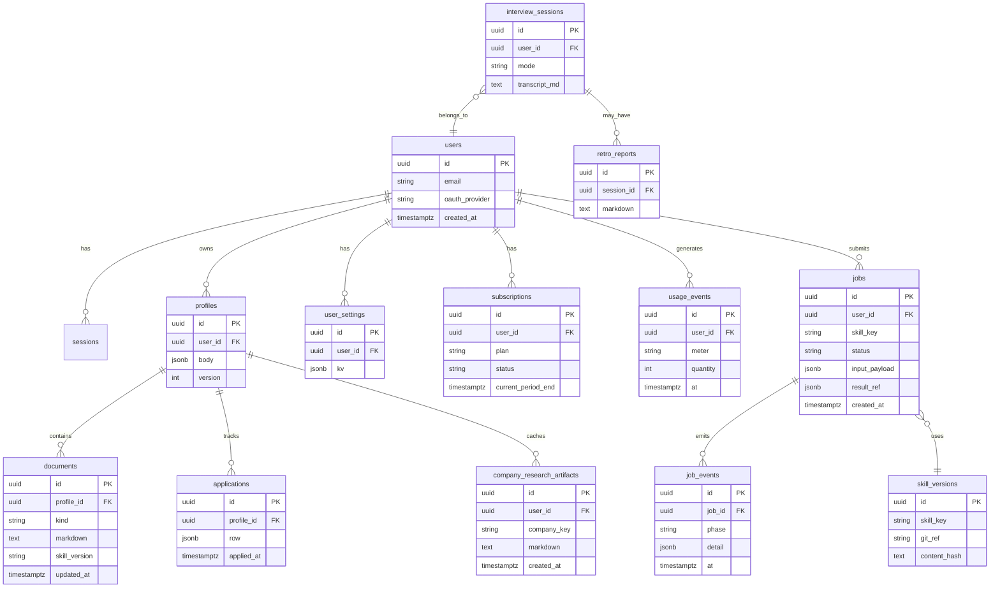

# JobStack 웹 SaaS — Phase 2: 데이터 모델·API 스켈레톤

**문서 목적**: [Phase 1 아키텍처](./saas-architecture-phase1.md) 이후 구현 착수를 위한 **ERD 초안**, **핵심 REST 경로**, **권장 레포 구조**를 한곳에 둔다.  
**범위**: DDL·OpenAPI 전문이 아니라 **스코프 확정용 초안**이다.

---

## 1. 권장 모노레포 레이아웃 (초안)

```
jobstack/
  apps/
    web/                 # Next.js (App Router), BFF = app/api/*
  packages/
    db/                  # Drizzle/Prisma 스키마, 마이그레이션
    api-contract/        # OpenAPI YAML 또는 ts 타입 (공유)
    worker/              # 스킬 실행·큐 소비 (선택: 별도 프로세스)
  skills/                # 기존 Markdown 스킬 (서버는 버전드 복사 또는 Git 서브트리)
  docs/
```

- **기존 루트 스킬·`bin/`**은 CLI 호환을 위해 유지하고, 웹은 `packages/db`의 스킬 버전 레코드와 연동한다.

---

## 2. ERD (논리) — Mermaid



**Phase 1 매핑 ([saas-architecture-phase1.md §5](./saas-architecture-phase1.md))**:

| CLI 경로 | 테이블·비고 |
|----------|-------------|
| `profiles/default.yaml` | `profiles` |
| `tracker/applications.jsonl` | `applications` (+ 이벤트 로그는 선택) |
| `company-cache/*.md` | `company_research_artifacts` |
| `interview-history/*.md` | `interview_sessions`, 첨부 문서는 `documents` |
| `analytics/skill-usage.jsonl` | `usage_events` |
| `config.yaml` | `user_settings` |

---

## 3. REST 경로 스켈레톤 (Phase 1 표와 정렬)

베이스 URL 예: `/api/v1` (BFF 뒤에 동일 접두사 유지)

| 메서드 | 경로 | 스킬 키 | 비고 |
|--------|------|---------|------|
| POST | `/sessions/auto-scan` | auto | 202 + job |
| POST | `/plans` | strategy | |
| POST | `/research/companies` | company-research | |
| POST | `/jobs/search` | job-search | |
| POST | `/profiles/{id}/ncs` | ncs | |
| POST | `/salary/analyze` | salary | |
| POST | `/documents/portfolio-review` | portfolio | |
| GET, POST | `/applications` | tracker | |
| POST | `/documents/resume` | resume | |
| POST | `/documents/cover-letter` | cover-letter | |
| POST | `/reviews` | review | |
| POST | `/interviews/sessions` | mock-interview | 스트리밍은 별 채널 |
| POST | `/interviews/{id}/retro` | retro | |

**공통 패턴**

- 장시간 작업: `POST` → `202 Accepted`, 바디에 `{ "jobId": "..." }` → `GET /jobs/{jobId}` 폴링 또는 SSE.
- 인증: BFF가 세션 검증 후 `user_id`를 내부 API에 전달.

---

## 4. OpenAPI 산출물 (다음 스프린트)

1. `packages/api-contract/openapi.yaml`에 위 경로를 **tags**로 묶고, `Job`, `Error`, `Profile` 스키마만 먼저 정의.
2. CI: `spectral` 또는 `redocly lint`로 계약 고정.
3. 웹 클라이언트는 `openapi-typescript` 등으로 타입 생성.

---

## 5. 워커·스킬 실행 (최소 규칙)

- `jobs.status`: `queued` | `running` | `succeeded` | `failed` | `cancelled`.
- 워커는 `skill_versions`에 묶인 `SKILL.md` 본문 + 사용자 입력으로 LLM 호출; 결과는 `documents` 또는 `job_events`에 누적.
- `prompt_hash` / `skill_version`은 Phase 1 리스크 완화용으로 `documents`·`jobs` 메타에 저장.

---

## 6. 체크리스트 (Phase 2 본 문서)

- [x] 논리 ERD 초안
- [x] Phase 1 HTTP 표와 REST 목록 정렬
- [x] 모노레포 디렉터리 제안
- [ ] DDL 초안 (다음 PR)
- [ ] `openapi.yaml` 1차 체크인 (다음 PR)
- [x] `apps/web` Next.js 스캐폴드 ([CHANGELOG](../CHANGELOG.md) 0.1.3, `docs/vercel-monorepo.md`)

---

**문서 버전**: 0.1  
**상위 문서**: [saas-architecture-phase1.md](./saas-architecture-phase1.md)
